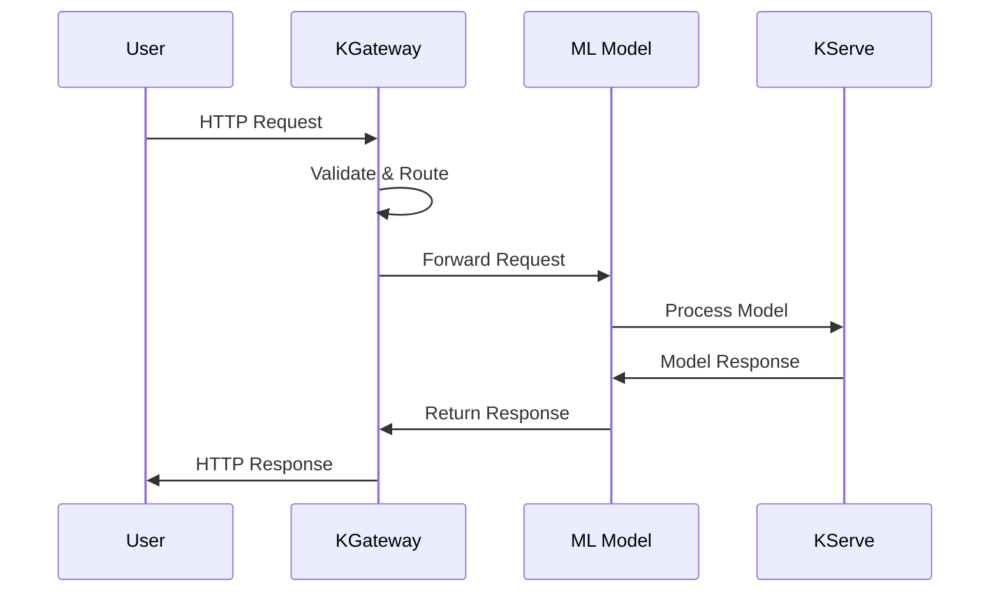
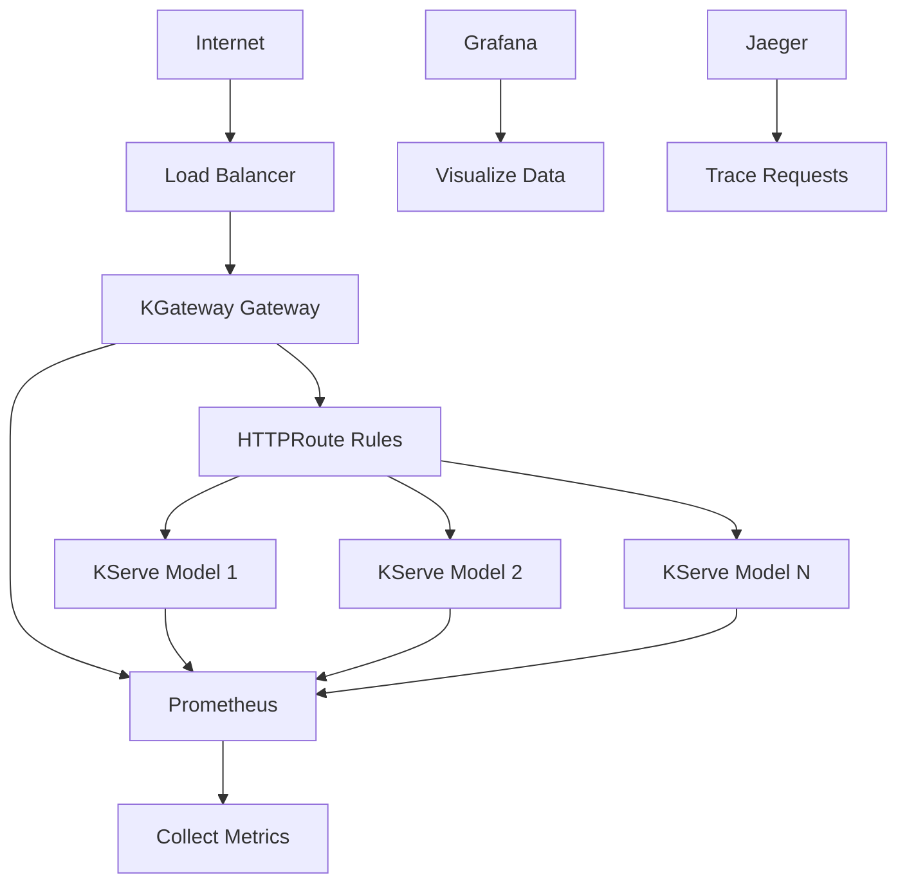

# 🌐 KGateway as Ingress for KServe

## What is KGateway?

**KGateway** is a Kubernetes ingress controller that acts as the front door to your machine learning models deployed with KServe. It directs incoming requests to the right AI model while providing security, monitoring, and traffic management.

## Why Do You Need It?

Without an ingress controller, your ML models would be isolated inside your Kubernetes cluster - unreachable from the outside world. KGateway solves this by:

-  **Providing External Access** - Makes your AI models accessible via HTTP/HTTPS
-  **Adding Security** - Implements authentication, authorization, and rate limiting
-  **Enabling Monitoring** - Provides metrics, logging, and tracing
-  **Managing Traffic** - Handles load balancing and routing
-  **Simplifying Operations** - Centralized configuration and management

## Prerequisites

### Required Components
- **KGateway Controller** - Deployed and running
- **KServe** - With Gateway API integration enabled
- **Kubernetes Cluster** - Version 1.29 or higher

### Verify Prerequisites

```bash
# Check KGateway controller status
kubectl get pods -n kgateway-system
kubectl logs -n kgateway-system deployment/kgateway-controller


# Check KServe status
kubectl get pods -n kserve
kubectl get inferenceservice -n ml-models
```

## How KGateway Works



## Technical Architecture



## Configuration Guide

### 1. Deploy KGateway Controller

```bash
# Create namespace
kubectl create namespace kgateway-system

# Deploy KGateway controller
kubectl apply -f - <<EOF
apiVersion: apps/v1
kind: Deployment
metadata:
  name: kgateway-controller
  namespace: kgateway-system
spec:
  replicas: 2
  selector:
    matchLabels:
      app: kgateway-controller
  template:
    metadata:
      labels:
        app: kgateway-controller
    spec:
      containers:
      - name: controller
        image: kgateway/controller:latest
        ports:
        - containerPort: 8080
        env:
        - name: ENVOY_GATEWAY_NAMESPACE
          value: "envoy-gateway-system"
        resources:
          requests:
            cpu: 100m
            memory: 128Mi
          limits:
            cpu: 500m
            memory: 512Mi
EOF

# Wait for deployment
kubectl wait --timeout=5m -n kgateway-system deployment/kgateway-controller --for=condition=Available
```

### 2. Create Gateway

```bash
# Create Gateway resource
kubectl apply -f - <<EOF
apiVersion: gateway.kgateway.dev/v1alpha1 # Or other version
kind: Gateway
metadata:
  name: kgateway-gateway
spec:
  gatewayClassName: kgateway # This class name must match KGateway's
  listeners:
  - name: http
    port: 80
    protocol: HTTP
    allowedRoutes:
      namespaces:
        from: All
  - name: https
    port: 443
    protocol: HTTPS
    allowedRoutes:
      namespaces:
        from: All
    tls:
      mode: Terminate
      certificateRefs:
      - name: kgateway-cert
        namespace: kgateway-system
EOF
```

### 3. Deploy Sample Model

```bash
# Create namespace for models
kubectl create namespace ml-models

# Deploy sample model
kubectl apply -f - <<EOF
apiVersion: serving.kserve.io/v1beta1
kind: InferenceService
metadata:
  name: sklearn-iris
  namespace: ml-models
spec:
  predictor:
    sklearn:
      storageUri: gs://kfserving-examples/models/sklearn/iris
      resources:
        requests:
          cpu: 100m
          memory: 256Mi
        limits:
          cpu: 1000m
          memory: 1Gi
EOF

# Wait for model to be ready
kubectl wait --timeout=10m -n ml-models inferenceservice/sklearn-iris --for=condition=Ready
```

### 4. Create HTTPRoute

```bash
# Create HTTPRoute for model access
kubectl apply -f - <<EOF
apiVersion: gateway.kgateway.dev/v1alpha1 # Or other version
kind: HTTPRoute
metadata:
  name: model-routes
  namespace: ml-models
spec:
  parentRefs:
    - name: kgateway-gateway
      namespace: kgateway-system
  rules:
    - matches:
        - path:
            type: PathPrefix
            value: /v1/models
      backendRefs:
        - name: sklearn-iris
          port: 8080
          kind: Service
EOF
```

### 5. Configure TLS (Optional)

```bash
# Create TLS certificate
kubectl apply -f - <<EOF
apiVersion: v1
kind: Secret
metadata:
  name: kgateway-cert
  namespace: kgateway-system
type: kubernetes.io/tls
data:
  tls.crt: <base64-encoded-certificate>
  tls.key: <base64-encoded-private-key>
EOF
```

## Testing the Setup

### 1. Get Gateway External IP

```bash
# Get external IP
GATEWAY_IP=$(kubectl get svc -n kgateway-system kgateway-gateway -o jsonpath='{.status.loadBalancer.ingress[0].ip}')

# If using NodePort or port-forward
kubectl port-forward -n kgateway-system svc/kgateway-gateway 8080:80 &
GATEWAY_IP="localhost:8080"
```

### 2. Test Basic Connectivity

```bash
# Health check
curl -v http://$GATEWAY_IP/health

# Model prediction
curl -X POST http://$GATEWAY_IP/v1/models/sklearn-iris:predict \
  -H "Content-Type: application/json" \
  -d '{"instances": [[5.1, 3.5, 1.4, 0.2]]}'
```

### 3. Test Model Endpoints

```bash
# List models
curl http://$GATEWAY_IP/v1/models

# Get model info
curl http://$GATEWAY_IP/v1/models/sklearn-iris

# Model prediction
curl -X POST http://$GATEWAY_IP/v1/models/sklearn-iris:predict \
  -H "Content-Type: application/json" \
  -d '{"instances": [[5.1, 3.5, 1.4, 0.2]]}'

# Model explanation
curl -X POST http://$GATEWAY_IP/v1/models/sklearn-iris:explain \
  -H "Content-Type: application/json" \
  -d '{"instances": [[5.1, 3.5, 1.4, 0.2]]}'
```

## Advanced Configuration

### 1. Multiple Models

```bash
# Deploy additional models
kubectl apply -f - <<EOF
apiVersion: serving.kserve.io/v1beta1
kind: InferenceService
metadata:
  name: tensorflow-mnist
  namespace: ml-models
spec:
  predictor:
    tensorflow:
      storageUri: gs://kfserving-examples/models/tensorflow/mnist
      resources:
        requests:
          cpu: 200m
          memory: 512Mi
        limits:
          cpu: 2000m
          memory: 2Gi
EOF

# Update HTTPRoute for multiple models
kubectl apply -f - <<EOF
apiVersion: gateway.networking.k8s.io/v1
kind: HTTPRoute
metadata:
  name: model-routes
  namespace: ml-models
spec:
  parentRefs:
    - name: kgateway-gateway
      namespace: kgateway-system
  rules:
    - matches:
        - path:
            type: PathPrefix
            value: /v1/models/sklearn-iris
      backendRefs:
        - name: sklearn-iris
          port: 8080
          kind: Service
    - matches:
        - path:
            type: PathPrefix
            value: /v1/models/tensorflow-mnist
      backendRefs:
        - name: tensorflow-mnist
          port: 8080
          kind: Service
EOF
```

### 2. Load Balancing

```bash
# Scale model replicas
kubectl scale deployment sklearn-iris-predictor-default -n ml-models --replicas=3

# Check load balancing
for i in {1..10}; do
  curl -s http://$GATEWAY_IP/v1/models/sklearn-iris:predict \
    -H "Content-Type: application/json" \
    -d '{"instances": [[5.1, 3.5, 1.4, 0.2]]}' &
done
wait
```

### 3. Custom Headers

```bash
# Add custom headers to requests
curl -X POST http://$GATEWAY_IP/v1/models/sklearn-iris:predict \
  -H "Content-Type: application/json" \
  -H "X-User-ID: user123" \
  -H "X-Request-ID: req-456" \
  -d '{"instances": [[5.1, 3.5, 1.4, 0.2]]}'
```

## Monitoring and Observability

### 1. Check Gateway Status

```bash
# Gateway status
kubectl get gateway -A
kubectl describe gateway kgateway-gateway -n kgateway-system

# HTTPRoute status
kubectl get httproute -A
kubectl describe httproute model-routes -n ml-models
```

### 2. Monitor Traffic

```bash
# Check gateway logs
kubectl logs -n kgateway-system deployment/kgateway-controller --tail=100

# Check model logs
kubectl logs -n ml-models deployment/sklearn-iris-predictor-default --tail=100

# Check metrics
kubectl exec -n kgateway-system deployment/kgateway-controller -- curl localhost:8080/metrics
```

### 3. Performance Metrics

```bash
# Response time
curl -w "Time: %{time_total}s\n" -o /dev/null -s \
  http://$GATEWAY_IP/v1/models/sklearn-iris:predict \
  -H "Content-Type: application/json" \
  -d '{"instances": [[5.1, 3.5, 1.4, 0.2]]}'

# Throughput test
for i in {1..100}; do
  curl -s http://$GATEWAY_IP/v1/models/sklearn-iris:predict \
    -H "Content-Type: application/json" \
    -d '{"instances": [[5.1, 3.5, 1.4, 0.2]]}' &
done
wait
```

## Troubleshooting

### Common Issues

#### Gateway Not Accessible
```bash
# Check gateway status
kubectl get gateway -A
kubectl describe gateway kgateway-gateway -n kgateway-system

# Check service
kubectl get svc -n kgateway-system
kubectl describe svc kgateway-gateway -n kgateway-system

# Check logs
kubectl logs -n kgateway-system deployment/kgateway-controller
```

#### Model Not Responding
```bash
# Check model status
kubectl get inferenceservice -n ml-models
kubectl describe inferenceservice sklearn-iris -n ml-models

# Check model pods
kubectl get pods -n ml-models
kubectl logs -n ml-models deployment/sklearn-iris-predictor-default

# Check endpoints
kubectl get endpoints -n ml-models
```

#### HTTPRoute Not Working
```bash
# Check HTTPRoute status
kubectl get httproute -A
kubectl describe httproute model-routes -n ml-models

# Check gateway configuration
kubectl exec -n kgateway-system deployment/kgateway-controller -- curl localhost:8080/config
```

### Debug Commands

```bash
# Check all resources
kubectl get all -n kgateway-system
kubectl get all -n ml-models

# Check events
kubectl get events -n kgateway-system --sort-by='.lastTimestamp'
kubectl get events -n ml-models --sort-by='.lastTimestamp'

# Check network policies
kubectl get networkpolicy -A

# Check ingress classes
kubectl get gatewayclass
```

## Best Practices

### 1. Security
- Use HTTPS in production
- Implement proper authentication
- Set resource limits
- Use network policies
- Regular security updates

### 2. Performance
- Monitor response times
- Set appropriate resource limits
- Use horizontal pod autoscaling
- Implement caching strategies
- Optimize model serving

### 3. Reliability
- Use multiple replicas
- Implement health checks
- Set up monitoring and alerting
- Regular backups
- Disaster recovery planning

### 4. Operations
- Use GitOps for configuration
- Implement CI/CD pipelines
- Regular testing and validation
- Documentation and runbooks
- Team training and knowledge sharing

## Next Steps

1. **Add Authentication** - Implement JWT or external authentication
2. **Configure Rate Limiting** - Protect against abuse
3. **Set Up Monitoring** - Deploy Prometheus and Grafana
4. **Implement TLS** - Secure communication
5. **Add Load Balancing** - Scale for production traffic

---

*KGateway provides a robust, scalable ingress solution for your ML models. With proper configuration and monitoring, you can serve models reliably in production.*

