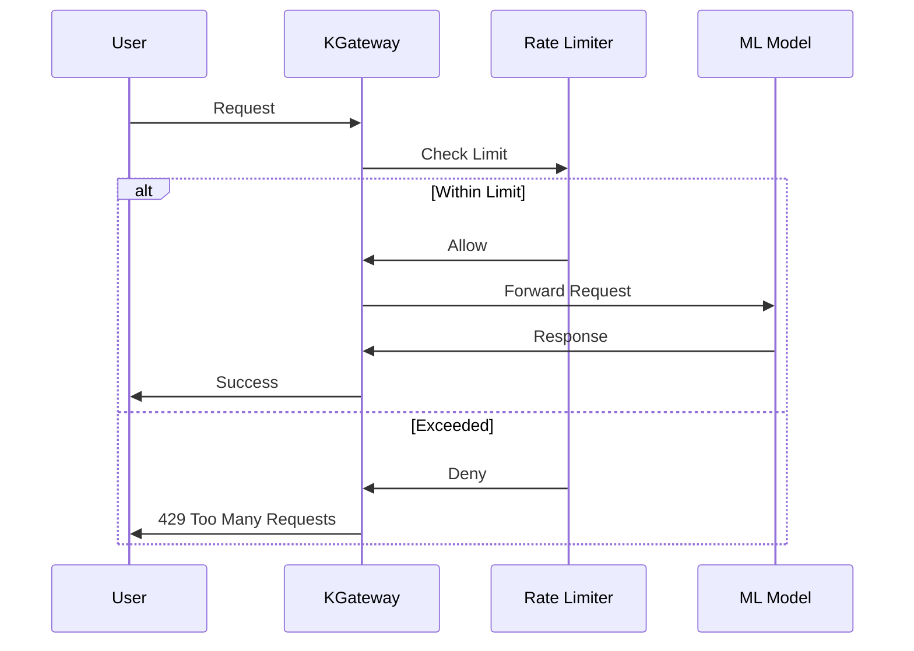

# ⚡ Rate Limiting for KServe APIs with KGateway

## What is Rate Limiting?

**Rate limiting** controls how many requests each user can make within a specific time period. It protects your AI models from being overwhelmed and ensures fair access for all users.

## Why Do You Need Rate Limiting?

Without rate limiting, your ML models are vulnerable to:

- 🚨 **API Abuse** - Malicious users flooding your models with requests
- 💰 **Cost Overruns** - Unexpected high usage leading to massive cloud bills
- 🐌 **Performance Degradation** - Legitimate users experiencing slow responses
- 🔒 **Security Risks** - Potential DoS attacks and resource exhaustion

Rate limiting solves these problems by:

- 🛡️ **Protecting Resources** - Prevents system overload
- 💳 **Controlling Costs** - Limits usage to prevent unexpected bills
- ⚖️ **Ensuring Fairness** - Equal access for all users
- 📊 **Providing Visibility** - Track usage patterns and abuse attempts

## Prerequisites

### Required Components
- **KGateway Controller** - Deployed and running
- **Envoy Gateway** - Version 1.3.0 or higher
- **KServe** - With Gateway API integration enabled
- **Redis** - For rate limiting backend (optional but recommended)

### Verify Prerequisites

```bash
# Check KGateway controller status
kubectl get pods -n kgateway-system
kubectl logs -n kgateway-system deployment/kgateway-controller

# Check Envoy Gateway status
kubectl get pods -n envoy-gateway-system
kubectl logs -n envoy-gateway-system deployment/envoy-gateway

# Check KServe status
kubectl get pods -n kserve
kubectl get inferenceservice -n ml-models
```

## How Rate Limiting Works with KGateway



## Technical Implementation

### 1. Deploy Rate Limiting Service

```bash
# Create namespace for rate limiting
kubectl create namespace rate-limit-system

# Deploy Redis for rate limiting backend
kubectl apply -f - <<EOF
apiVersion: apps/v1
kind: Deployment
metadata:
  name: redis
  namespace: rate-limit-system
spec:
  replicas: 1
  selector:
    matchLabels:
      app: redis
  template:
    metadata:
      labels:
        app: redis
    spec:
      containers:
      - name: redis
        image: redis:7-alpine
        ports:
        - containerPort: 6379
        resources:
          requests:
            cpu: 100m
            memory: 128Mi
          limits:
            cpu: 500m
            memory: 512Mi
---
apiVersion: v1
kind: Service
metadata:
  name: redis
  namespace: rate-limit-system
spec:
  ports:
  - port: 6379
    targetPort: 6379
  selector:
    app: redis
EOF
```

### 2. Deploy Envoy Rate Limiting Service

```bash
# Deploy Envoy rate limiting service
kubectl apply -f - <<EOF
apiVersion: apps/v1
kind: Deployment
metadata:
  name: rate-limit
  namespace: rate-limit-system
spec:
  replicas: 2
  selector:
    matchLabels:
      app: rate-limit
  template:
    metadata:
      labels:
        app: rate-limit
    spec:
      containers:
      - name: rate-limit
        image: envoyproxy/ratelimit:master
        ports:
        - containerPort: 8080
        - containerPort: 6070
        env:
        - name: REDIS_SOCKET_TYPE
          value: tcp
        - name: REDIS_URL
          value: redis:6379
        - name: USE_STATSD
          value: "false"
        - name: LOG_LEVEL
          value: debug
        - name: RUNTIME_ROOT
          value: /data
        - name: RUNTIME_SUBDIRECTORY
          value: ratelimit
        resources:
          requests:
            cpu: 100m
            memory: 128Mi
          limits:
            cpu: 500m
            memory: 512Mi
---
apiVersion: v1
kind: Service
metadata:
  name: rate-limit
  namespace: rate-limit-system
spec:
  ports:
  - port: 8080
    targetPort: 8080
    name: http
  - port: 6070
    targetPort: 6070
    name: grpc
  selector:
    app: rate-limit
EOF
```

### 3. Configure Rate Limiting Rules

```bash
# Create rate limiting configuration
kubectl apply -f - <<EOF
apiVersion: v1
kind: ConfigMap
metadata:
  name: rate-limit-config
  namespace: rate-limit-system
data:
  config.yaml: |
    domain: kserve
    descriptors:
      - key: generic_key
        value: default
        rate_limit:
          unit: minute
          requests_per_unit: 100
      - key: generic_key
        value: premium
        rate_limit:
          unit: minute
          requests_per_unit: 1000
      - key: generic_key
        value: admin
        rate_limit:
          unit: minute
          requests_per_unit: 10000
      - key: path
        value: "/v1/models/sklearn-iris:predict"
        rate_limit:
          unit: minute
          requests_per_unit: 50
      - key: user_id
        rate_limit:
          unit: minute
          requests_per_unit: 10
EOF
```

### 4. Update HTTPRoute with Rate Limiting

```bash
# Apply HTTPRoute with rate limiting
kubectl apply -f - <<EOF
apiVersion: gateway.networking.k8s.io/v1
kind: HTTPRoute
metadata:
  name: model-routes-with-rate-limit
  namespace: ml-models
spec:
  parentRefs:
    - name: kgateway-gateway
      namespace: kgateway-system
  rules:
    - matches:
        - path:
            type: PathPrefix
            value: /v1/models
      backendRefs:
        - name: sklearn-iris
          port: 8080
          kind: Service
      filters:
        - type: ExtensionRef
          extensionRef:
            group: gateway.envoyproxy.io
            kind: RateLimitFilter
            name: kserve-rate-limit
---
apiVersion: gateway.envoyproxy.io/v1alpha1
kind: RateLimitFilter
metadata:
  name: kserve-rate-limit
  namespace: ml-models
spec:
  type: Global
  global:
    rules:
    - clientSelectors:
      - headers:
        - name: x-user-type
          value: premium
      limit:
        requests: 1000
        unit: Minute
    - clientSelectors:
      - headers:
        - name: x-user-type
          value: admin
      limit:
        requests: 10000
        unit: Minute
    - limit:
        requests: 100
        unit: Minute
EOF
```

## Testing Rate Limiting

### 1. Test Basic Rate Limiting

```bash
# Get gateway external IP
GATEWAY_IP=$(kubectl get svc -n kgateway-system kgateway-gateway -o jsonpath='{.status.loadBalancer.ingress[0].ip}')

# Test default rate limit (100 requests per minute)
for i in {1..110}; do
  response=$(curl -s -w "%{http_code}" -o /dev/null \
    -X POST http://$GATEWAY_IP/v1/models/sklearn-iris:predict \
    -H "Content-Type: application/json" \
    -d '{"instances": [[5.1, 3.5, 1.4, 0.2]]}')
  
  if [ "$response" = "429" ]; then
    echo "Rate limit hit at request $i"
    break
  fi
done
```

### 2. Test User-Specific Limits

```bash
# Test premium user (1000 requests per minute)
for i in {1..1010}; do
  response=$(curl -s -w "%{http_code}" -o /dev/null \
    -X POST http://$GATEWAY_IP/v1/models/sklearn-iris:predict \
    -H "Content-Type: application/json" \
    -H "x-user-type: premium" \
    -d '{"instances": [[5.1, 3.5, 1.4, 0.2]]}')
  
  if [ "$response" = "429" ]; then
    echo "Premium rate limit hit at request $i"
    break
  fi
done

# Test admin user (10000 requests per minute)
for i in {1..10010}; do
  response=$(curl -s -w "%{http_code}" -o /dev/null \
    -X POST http://$GATEWAY_IP/v1/models/sklearn-iris:predict \
    -H "Content-Type: application/json" \
    -H "x-user-type: admin" \
    -d '{"instances": [[5.1, 3.5, 1.4, 0.2]]}')
  
  if [ "$response" = "429" ]; then
    echo "Admin rate limit hit at request $i"
    break
  fi
done
```

### 3. Test Path-Specific Limits

```bash
# Test specific endpoint limit (50 requests per minute)
for i in {1..60}; do
  response=$(curl -s -w "%{http_code}" -o /dev/null \
    -X POST http://$GATEWAY_IP/v1/models/sklearn-iris:predict \
    -H "Content-Type: application/json" \
    -d '{"instances": [[5.1, 3.5, 1.4, 0.2]]}')
  
  if [ "$response" = "429" ]; then
    echo "Path-specific rate limit hit at request $i"
    break
  fi
done
```

## Advanced Rate Limiting Patterns

### 1. IP-Based Rate Limiting

```yaml
# Rate limit by IP address
apiVersion: gateway.envoyproxy.io/v1alpha1
kind: RateLimitFilter
metadata:
  name: ip-based-rate-limit
  namespace: ml-models
spec:
  type: Global
  global:
    rules:
    - clientSelectors:
      - sourceIP: "192.168.1.0/24"
      limit:
        requests: 50
        unit: Minute
    - clientSelectors:
      - sourceIP: "10.0.0.0/8"
      limit:
        requests: 200
        unit: Minute
```

### 2. Time-Based Rate Limiting

```yaml
# Different limits for different times
apiVersion: gateway.envoyproxy.io/v1alpha1
kind: RateLimitFilter
metadata:
  name: time-based-rate-limit
  namespace: ml-models
spec:
  type: Global
  global:
    rules:
    - clientSelectors:
      - headers:
        - name: x-time-window
          value: "business-hours"
      limit:
        requests: 1000
        unit: Hour
    - clientSelectors:
      - headers:
        - name: x-time-window
          value: "off-hours"
      limit:
        requests: 100
        unit: Hour
```

### 3. Burst Rate Limiting

```yaml
# Allow bursts with sustained limits
apiVersion: gateway.envoyproxy.io/v1alpha1
kind: RateLimitFilter
metadata:
  name: burst-rate-limit
  namespace: ml-models
spec:
  type: Global
  global:
    rules:
    - limit:
        requests: 10
        unit: Second
    - limit:
        requests: 1000
        unit: Hour
```

## Monitoring Rate Limiting

### 1. Check Rate Limiting Service

```bash
# Check rate limiting service status
kubectl get pods -n rate-limit-system
kubectl logs -n rate-limit-system deployment/rate-limit

# Check Redis status
kubectl get pods -n rate-limit-system | grep redis
kubectl logs -n rate-limit-system deployment/redis
```

### 2. Monitor Rate Limit Metrics

```bash
# Check rate limiting metrics
kubectl port-forward -n rate-limit-system svc/rate-limit 8080:8080 &
curl http://localhost:8080/stats

# Check Redis metrics
kubectl port-forward -n rate-limit-system svc/redis 6379:6379 &
redis-cli -h localhost -p 6379 info memory
```

### 3. View Rate Limit Headers

```bash
# Check rate limit headers in response
curl -I -X POST http://$GATEWAY_IP/v1/models/sklearn-iris:predict \
  -H "Content-Type: application/json" \
  -d '{"instances": [[5.1, 3.5, 1.4, 0.2]]}'

# Expected headers:
# X-RateLimit-Limit: 100
# X-RateLimit-Remaining: 99
# X-RateLimit-Reset: 1640995200
```

## Troubleshooting

### Common Issues

#### Rate Limiting Not Working
```bash
# Check rate limiting service
kubectl get pods -n rate-limit-system
kubectl logs -n rate-limit-system deployment/rate-limit

# Check HTTPRoute configuration
kubectl get httproute -A
kubectl describe httproute model-routes-with-rate-limit -n ml-models

# Check RateLimitFilter
kubectl get ratelimitfilter -A
kubectl describe ratelimitfilter kserve-rate-limit -n ml-models
```

#### Redis Connection Issues
```bash
# Check Redis connectivity
kubectl exec -n rate-limit-system deployment/rate-limit -- \
  redis-cli -h redis -p 6379 ping

# Check Redis logs
kubectl logs -n rate-limit-system deployment/redis

# Check network policies
kubectl get networkpolicy -A
```

#### Incorrect Rate Limits
```bash
# Check rate limiting configuration
kubectl get configmap rate-limit-config -n rate-limit-system -o yaml

# Test rate limiting rules
kubectl exec -n rate-limit-system deployment/rate-limit -- \
  curl -X POST http://localhost:8080/json \
  -H "Content-Type: application/json" \
  -d '{"domain": "kserve", "descriptors": [{"key": "generic_key", "value": "default"}]}'
```

## Best Practices

### 1. Rate Limiting Strategy
- Start with conservative limits
- Monitor usage patterns
- Adjust limits based on user feedback
- Implement different tiers (free/premium/enterprise)
- Use burst limits for better user experience

### 2. Configuration
- Use Redis for distributed rate limiting
- Deploy multiple rate limiting service replicas
- Set appropriate resource limits
- Monitor rate limiting service performance
- Implement circuit breakers

### 3. Monitoring
- Track rate limit violations
- Monitor rate limiting service health
- Set up alerts for unusual patterns
- Log rate limiting decisions
- Analyze usage trends

## Next Steps

1. **Add Authentication** - Implement user-based rate limiting
2. **Set Up Monitoring** - Deploy metrics collection
3. **Optimize Limits** - Adjust based on usage patterns
4. **Implement Caching** - Reduce model load
5. **Add Alerting** - Get notified of violations

---

*Rate limiting is essential for protecting your ML models and ensuring fair access. With KGateway, you get flexible, scalable rate limiting that grows with your platform.*
