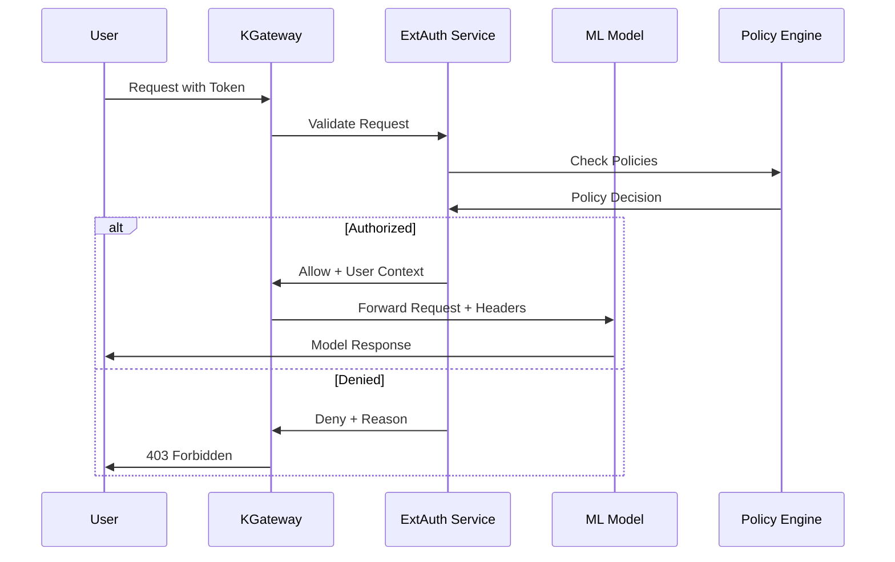

# 🔐 External Authentication (ExtAuth) for KServe with KGateway

## What is External Authentication?

**External Authentication (ExtAuth)** validates requests with a central security system before allowing access to ML models. Instead of each model handling its own authentication, all requests are validated by a dedicated external service.

## Why Use External Authentication?

Traditional authentication has limitations:

- 🔄 **Duplicated Logic** - Each service implements its own auth
- 🐛 **Inconsistent Security** - Different auth implementations create gaps
- 🔧 **Hard to Maintain** - Updates require changing every service
- 📊 **Limited Visibility** - No centralized access control monitoring

ExtAuth solves these problems by:

- 🏛️ **Centralizing Authentication** - Single source of truth for access control
- 🔒 **Consistent Security** - Same auth logic across all models
- 📈 **Better Observability** - Centralized logging and monitoring
- 🎯 **Advanced Policies** - Support for complex authorization rules

## Prerequisites

### Required Components
- **KGateway Controller** - Deployed and running
- **Envoy Gateway** - Version 1.3.0 or higher
- **KServe** - With Gateway API integration enabled
- **OPA (Open Policy Agent)** - For policy evaluation

### Verify Prerequisites

```bash
# Check KGateway controller status
kubectl get pods -n kgateway-system
kubectl logs -n kgateway-system deployment/kgateway-controller

# Check Envoy Gateway status
kubectl get pods -n envoy-gateway-system
kubectl logs -n envoy-gateway-system deployment/envoy-gateway

# Check KServe status
kubectl get pods -n kserve
kubectl get inferenceservice -n ml-models

# Check if OPA is already deployed
kubectl get pods -A | grep opa
```

## How External Authentication Works



## Technical Implementation

### 1. Deploy OPA (Open Policy Agent)

```bash
# Create namespace for external auth
kubectl create namespace ext-auth-system

# Deploy OPA
kubectl apply -f - <<EOF
apiVersion: apps/v1
kind: Deployment
metadata:
  name: opa-ext-authz
  namespace: ext-auth-system
spec:
  replicas: 2
  selector:
    matchLabels:
      app: opa-ext-authz
  template:
    metadata:
      labels:
        app: opa-ext-authz
    spec:
      containers:
      - name: opa
        image: openpolicyagent/opa:latest-envoy
        args:
        - "run"
        - "--server"
        - "--config-file=/config/opa-config.yaml"
        - "/policies"
        ports:
        - containerPort: 8181
        - containerPort: 9191
        resources:
          requests:
            cpu: 100m
            memory: 128Mi
          limits:
            cpu: 500m
            memory: 512Mi
        livenessProbe:
          httpGet:
            path: /health?bundle=true
            port: 8181
          initialDelaySeconds: 5
          periodSeconds: 10
        readinessProbe:
          httpGet:
            path: /health?bundle=true
            port: 8181
          initialDelaySeconds: 5
          periodSeconds: 5
---
apiVersion: v1
kind: Service
metadata:
  name: opa-ext-authz
  namespace: ext-auth-system
spec:
  ports:
  - port: 8181
    targetPort: 8181
    name: http
  - port: 9191
    targetPort: 9191
    name: grpc
  selector:
    app: opa-ext-authz
EOF
```

### 2. Configure OPA Policies

```bash
# Create OPA configuration
kubectl apply -f - <<EOF
apiVersion: v1
kind: ConfigMap
metadata:
  name: opa-config
  namespace: ext-auth-system
data:
  opa-config.yaml: |
    services:
      kserve-auth:
        url: http://localhost:8181
    bundles:
      kserve-auth:
        service: kserve-auth
        resource: /bundles/kserve-auth
    decision_logs:
      service: kserve-auth
    status:
      service: kserve-auth
  policy.rego: |
    package envoy.authz

    import input.attributes.request.http as http_request
    import input.attributes.request.http.headers as headers

    default allow = false

    allow {
        # Allow health checks
        http_request.method == "GET"
        http_request.path == "/health"
    }

    allow {
        # Allow metrics
        http_request.method == "GET"
        http_request.path == "/metrics"
    }

    allow {
        # Check JWT token
        token := headers.authorization
        token != null
        startswith(token, "Bearer ")
        jwt_payload := io.jwt.decode(token[7:])[1]
        jwt_payload.iss == "https://your-auth-provider.com"
        jwt_payload.aud == "kserve-api"
        time.now_ns() / 1000000000 < jwt_payload.exp
        jwt_payload.role in ["admin", "data-scientist", "developer"]
    }

    allow {
        # Check API key
        api_key := headers["x-api-key"]
        api_key != null
        valid_keys := data.api_keys
        api_key in valid_keys
    }
EOF
```

### 3. Configure Envoy for External Authorization

```bash
# Create EnvoyFilter for external authorization
kubectl apply -f - <<EOF
apiVersion: networking.istio.io/v1alpha3
kind: EnvoyFilter
metadata:
  name: ext-authz
  namespace: kgateway-system
spec:
  configPatches:
  - applyTo: HTTP_FILTER
    match:
      context: GATEWAY
      listener:
        filterChain:
          filter:
            name: "envoy.filters.network.http_connection_manager"
    patch:
      operation: INSERT_BEFORE
      value:
        name: envoy.filters.http.ext_authz
        typed_config:
          "@type": type.googleapis.com/envoy.extensions.filters.http.ext_authz.v3.ExtAuthz
          grpc_service:
            envoy_grpc:
              cluster_name: ext-authz
            timeout: 0.5s
          include_peer_certificate: true
          failure_mode_allow: false
          with_request_body:
            max_request_bytes: 8192
            allow_partial_message: true
          transport_api_version: V3
---
apiVersion: networking.istio.io/v1alpha3
kind: EnvoyFilter
metadata:
  name: ext-authz-cluster
  namespace: kgateway-system
spec:
  configPatches:
  - applyTo: CLUSTER
    match:
      context: GATEWAY
    patch:
      operation: ADD
      value:
        name: ext-authz
        connect_timeout: 0.5s
        type: STRICT_DNS
        lb_policy: ROUND_ROBIN
        http2_protocol_options: {}
        load_assignment:
          cluster_name: ext-authz
          endpoints:
          - lb_endpoints:
            - endpoint:
                address:
                  socket_address:
                    address: opa-ext-authz.ext-auth-system.svc.cluster.local
                    port_value: 9191
EOF
```

### 4. Update HTTPRoute with Authentication

```bash
# Apply HTTPRoute with external authentication
kubectl apply -f - <<EOF
apiVersion: gateway.networking.k8s.io/v1
kind: HTTPRoute
metadata:
  name: model-routes-with-ext-auth
  namespace: ml-models
spec:
  parentRefs:
    - name: kgateway-gateway
      namespace: kgateway-system
  rules:
    - matches:
        - path:
            type: PathPrefix
            value: /v1/models
      backendRefs:
        - name: sklearn-iris
          port: 8080
          kind: Service
      filters:
        - type: RequestAuthentication
          requestAuthentication:
            jwtRules:
              - issuer: "https://your-auth-provider.com"
                audiences: ["kserve-api"]
                jwksUri: "https://your-auth-provider.com/.well-known/jwks.json"
                forwardOriginalToken: true
        - type: AuthorizationPolicy
          authorizationPolicy:
            rules:
              - from:
                  - source:
                      requestPrincipals: ["*"]
                to:
                  - operation:
                      methods: ["GET", "POST"]
                      paths: ["/v1/models/*"]
                when:
                  - key: request.auth.claims[role]
                    values: ["admin", "data-scientist", "developer"]
EOF
```

## Testing External Authentication

### 1. Test Without Authentication

```bash
# Get gateway external IP
GATEWAY_IP=$(kubectl get svc -n kgateway-system kgateway-gateway -o jsonpath='{.status.loadBalancer.ingress[0].ip}')

# Should be denied
curl -X POST http://$GATEWAY_IP/v1/models/sklearn-iris:predict \
  -H "Content-Type: application/json" \
  -d '{"instances": [[5.1, 3.5, 1.4, 0.2]]}'

# Expected response: 403 Forbidden
```

### 2. Test With Valid JWT

```bash
# Generate or get JWT token
JWT="eyJhbGciOiJSUzI1NiIsInR5cCI6IkpXVCJ9..."

# Should be allowed
curl -X POST http://$GATEWAY_IP/v1/models/sklearn-iris:predict \
  -H "Authorization: Bearer $JWT" \
  -H "Content-Type: application/json" \
  -d '{"instances": [[5.1, 3.5, 1.4, 0.2]]}'
```

### 3. Test Role-Based Access

```bash
# Admin user - should access everything
curl -H "Authorization: Bearer $ADMIN_JWT" \
  http://$GATEWAY_IP/v1/models

# Data scientist - should only access prediction
curl -H "Authorization: Bearer $DS_JWT" \
  -X POST http://$GATEWAY_IP/v1/models/sklearn-iris:predict \
  -H "Content-Type: application/json" \
  -d '{"instances": [[5.1, 3.5, 1.4, 0.2]]}'

# Data scientist trying admin endpoint - should be denied
curl -H "Authorization: Bearer $DS_JWT" \
  -X DELETE http://$GATEWAY_IP/v1/models/sklearn-iris
```

### 4. Test Health Endpoints

```bash
# Health check should work without auth
curl http://$GATEWAY_IP/health

# Metrics endpoint should work without auth
curl http://$GATEWAY_IP/metrics
```

## Advanced Features

### 1. Dynamic Policy Updates

```bash
# Update policies without restarting
curl -X PUT http://opa-ext-authz.ext-auth-system.svc.cluster.local:8181/v1/policies/authz \
  -H "Content-Type: text/plain" \
  --data-binary @new-policy.rego

# Check policy status
curl http://opa-ext-authz.ext-auth-system.svc.cluster.local:8181/v1/data/envoy/authz/allow \
  -H "Content-Type: application/json" \
  -d @test-input.json
```

### 2. Context Injection

```rego
# Add user context to request headers
context_headers := {
    "x-user-id": jwt_payload.sub,
    "x-user-role": jwt_payload.role,
    "x-user-email": jwt_payload.email,
    "x-organization": jwt_payload.org,
    "x-permissions": json.marshal(jwt_payload.permissions)
}
```

### 3. Audit Logging

```rego
# Log all authorization decisions
decision_log := {
    "timestamp": time.now_ns(),
    "user": jwt_payload.sub,
    "role": jwt_payload.role,
    "action": input.attributes.request.http.method,
    "resource": input.attributes.request.http.path,
    "ip": input.attributes.source.address.socket_address.address,
    "decision": allow,
    "reason": reason,
    "request_id": input.attributes.request.http.headers["x-request-id"]
}
```

## Monitoring & Observability

### 1. OPA Metrics

```bash
# Check OPA decision metrics
kubectl port-forward -n ext-auth-system svc/opa-ext-authz 8181:8181
curl http://localhost:8181/metrics

# Key metrics:
# - opa_http_request_duration_seconds
# - opa_rego_query_eval_counter_total
# - opa_decision_logs_nd_events_total
# - opa_bundle_request_duration_seconds
```

### 2. Authorization Audit Trail

```yaml
# Configure decision logging
config:
  decision_logs:
    console: true
    reporting:
      min_delay_seconds: 5
      max_delay_seconds: 10
    service: kserve-auth
    partition_name: authz-decisions
```

### 3. Performance Monitoring

```bash
# Check external auth latency
kubectl logs -n kgateway-system deployment/kgateway-controller | grep ext_authz

# Monitor OPA response times
curl http://opa-ext-authz.ext-auth-system.svc.cluster.local:8181/v1/data/system/diagnostics

# Check auth service health
kubectl get pods -n ext-auth-system
kubectl top pods -n ext-auth-system
```

## Troubleshooting

### External Auth Not Working

```bash
# Check if OPA is running
kubectl get pods -n ext-auth-system | grep opa

# Verify EnvoyFilter is applied
kubectl get envoyfilter ext-authz -n kgateway-system

# Check Envoy configuration
kubectl exec -n kgateway-system deployment/kgateway-controller -- \
  curl localhost:15000/config_dump | grep ext_authz

# Check OPA logs
kubectl logs -n ext-auth-system deployment/opa-ext-authz
```

### Requests Always Denied

```bash
# Check OPA logs
kubectl logs -n ext-auth-system deployment/opa-ext-authz

# Test policy directly
curl -X POST http://opa-ext-authz.ext-auth-system.svc.cluster.local:8181/v1/data/envoy/authz/allow \
  -H "Content-Type: application/json" \
  -d @test-input.json

# Check JWT token validity
kubectl exec -n ext-auth-system deployment/opa-ext-authz -- \
  opa eval --data /policies/policy.rego --input @test-input.json data.envoy.authz.allow
```

### High Latency

```bash
# Check auth service performance
kubectl top pods -n ext-auth-system | grep opa

# Monitor auth request times
kubectl exec -n kgateway-system deployment/kgateway-controller -- \
  curl localhost:15000/stats | grep ext_authz

# Check OPA metrics
curl http://opa-ext-authz.ext-auth-system.svc.cluster.local:8181/metrics | grep duration
```

## Best Practices

### 1. Security
- Validate all inputs
- Use secure channels (TLS)
- Implement timeouts
- Log security events
- Rotate keys regularly

### 2. Performance
- Cache decisions
- Optimize policies
- Use circuit breakers
- Monitor latency
- Scale horizontally

### 3. Reliability
- High availability deployment
- Graceful degradation
- Health checks
- Backup policies
- Auto-scaling

### 4. Observability
- Comprehensive logging
- Metrics collection
- Alerting
- Tracing
- Audit trail

## Next Steps

1. **Deploy OPA Service** - Set up external authentication
2. **Write Policies** - Define your authorization rules
3. **Test Thoroughly** - Validate all access scenarios
4. **Monitor Performance** - Track auth latency and success rates
5. **Implement Audit** - Log all authorization decisions
6. **Scale Infrastructure** - Handle high-traffic scenarios

---

*External authentication provides centralized, consistent, and auditable access control for your ML models. With KGateway, you get enterprise-grade authentication that scales with your ML platform.*
