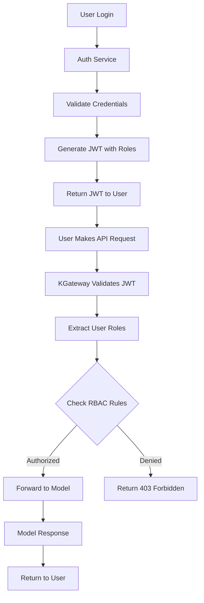

# 🗝️ JWT Authentication & RBAC for KServe with KGateway

## What is JWT & RBAC?

**JWT (JSON Web Tokens)** are digital ID cards that contain information about users and their permissions. **RBAC (Role-Based Access Control)** grants access based on a user's role rather than their individual identity.

## Why Use JWT & RBAC?

Traditional authentication has problems:

- 🔄 **Stateful Sessions** - Server must remember who's logged in
- 🌐 **Not Scalable** - Doesn't work well across multiple services
- 🔒 **Limited Information** - Just "logged in" or "not logged in"
- 🚫 **No Fine-Grained Control** - All authenticated users get same access

JWT & RBAC solve these issues:

- 🎫 **Self-Contained** - All info is in the token itself
- 🌍 **Distributed** - Works across multiple services and systems
- 📋 **Rich Information** - Contains user details, roles, permissions
- 🎯 **Granular Control** - Different access levels for different users
- ⚡ **Stateless** - No server-side session management needed

## Prerequisites

### Required Components
- **KGateway Controller** - Deployed and running
- **Envoy Gateway** - Version 1.3.0 or higher
- **KServe** - With Gateway API integration enabled
- **JWT Issuer** - For token generation (Auth0, Keycloak, etc.)
- **JWKS Endpoint** - For public key distribution

### Verify Prerequisites

```bash
# Check KGateway controller status
kubectl get pods -n kgateway-system
kubectl logs -n kgateway-system deployment/kgateway-controller

# Check Envoy Gateway status
kubectl get pods -n envoy-gateway-system
kubectl logs -n envoy-gateway-system deployment/envoy-gateway

# Check KServe status
kubectl get pods -n kserve
kubectl get inferenceservice -n ml-models

# Check if JWT issuer is accessible
curl -I https://your-auth-provider.com/.well-known/jwks.json
```

## How JWT & RBAC Work Together



### JWT Token Structure

```json
{
  "header": {
    "alg": "RS256",
    "typ": "JWT",
    "kid": "key-1"
  },
  "payload": {
    "iss": "https://auth.company.com",
    "sub": "user123",
    "aud": ["kserve-api", "ml-inference"],
    "exp": 1734240000,
    "iat": 1734236400,
    "role": "data-scientist",
    "email": "user@company.com",
    "team": "ml-platform",
    "permissions": ["model:predict", "model:explain"]
  },
  "signature": "..."
}
```

## Technical Implementation

### 1. KGateway JWT Validation Configuration

```yaml
apiVersion: gateway.networking.k8s.io/v1
kind: HTTPRoute
metadata:
  name: model-routes-with-jwt
  namespace: ml-models
spec:
  parentRefs:
    - name: kgateway-gateway
      namespace: kgateway-system
  rules:
    - matches:
        - path:
            type: PathPrefix
            value: /v1/models
      backendRefs:
        - name: sklearn-iris
          port: 8080
          kind: Service
      filters:
        - type: RequestAuthentication
          requestAuthentication:
            jwtRules:
              - issuer: "https://auth.company.com"
                jwksUri: "https://auth.company.com/.well-known/jwks.json"
                audiences: ["kserve-api", "ml-inference"]
                forwardOriginalToken: true
        - type: AuthorizationPolicy
          authorizationPolicy:
            rules:
              - from:
                  - source:
                      requestPrincipals: ["*"]
                to:
                  - operation:
                      methods: ["GET", "POST"]
                      paths: ["/v1/models/*"]
                when:
                  - key: request.auth.claims[role]
                    values: ["admin", "data-scientist", "model-developer"]
```

### 2. Istio Security Policies

```yaml
# RequestAuthentication for JWT validation
apiVersion: security.istio.io/v1beta1
kind: RequestAuthentication
metadata:
  name: kserve-jwt-auth
  namespace: ml-models
spec:
  selector:
    matchLabels:
      app: kserve
  jwtRules:
  - issuer: "https://auth.company.com"
    jwksUri: "https://auth.company.com/.well-known/jwks.json"
    audiences:
    - "kserve-api"
    - "ml-inference"
    forwardOriginalToken: true
```

### 3. RBAC Authorization Policy

```yaml
# AuthorizationPolicy for role-based access
apiVersion: security.istio.io/v1beta1
kind: AuthorizationPolicy
metadata:
  name: kserve-rbac
  namespace: ml-models
spec:
  selector:
    matchLabels:
      app: kserve
  rules:
  # Admin users - full access
  - from:
    - source:
        requestPrincipals: ["https://auth.company.com/admin"]
    to:
    - operation:
        methods: ["GET", "POST", "PUT", "DELETE"]
  
  # Data scientists - inference only
  - from:
    - source:
        requestPrincipals: ["https://auth.company.com/data-scientist"]
    to:
    - operation:
        methods: ["GET", "POST"]
        paths: ["/v1/models/*:predict", "/v1/models/*:explain", "/health"]
  
  # Model developers - model management
  - from:
    - source:
        requestPrincipals: ["https://auth.company.com/model-developer"]
    to:
    - operation:
        methods: ["GET", "POST", "PUT", "DELETE"]
        paths: ["/v1/models/*"]
  
  # Public health checks (no auth required)
  - to:
    - operation:
        methods: ["GET"]
        paths: ["/health"]
```

## Configuration Guide

### 1. Set Up JWT Validation

```bash
# Apply JWT authentication policy
kubectl apply -f - <<EOF
apiVersion: security.istio.io/v1beta1
kind: RequestAuthentication
metadata:
  name: kserve-jwt-auth
  namespace: ml-models
spec:
  selector:
    matchLabels:
      app: kserve
  jwtRules:
  - issuer: "https://your-auth-provider.com"
    jwksUri: "https://your-auth-provider.com/.well-known/jwks.json"
    audiences:
    - "kserve-api"
    - "ml-inference"
    forwardOriginalToken: true
EOF
```

### 2. Configure RBAC Rules

```bash
# Apply authorization policy
kubectl apply -f - <<EOF
apiVersion: security.istio.io/v1beta1
kind: AuthorizationPolicy
metadata:
  name: kserve-rbac
  namespace: ml-models
spec:
  selector:
    matchLabels:
      app: kserve
  rules:
  # Admin users - full access
  - from:
    - source:
        requestPrincipals: ["https://your-auth-provider.com/admin"]
    to:
    - operation:
        methods: ["*"]
  
  # Data scientists - inference only
  - from:
    - source:
        requestPrincipals: ["https://your-auth-provider.com/data-scientist"]
    to:
    - operation:
        methods: ["GET", "POST"]
        paths: ["/v1/models/*:predict", "/v1/models/*:explain"]
  
  # Model developers - model management
  - from:
    - source:
        requestPrincipals: ["https://your-auth-provider.com/model-developer"]
    to:
    - operation:
        methods: ["GET", "POST", "PUT", "DELETE"]
        paths: ["/v1/models/*"]
  
  # Public health checks
  - to:
    - operation:
        methods: ["GET"]
        paths: ["/health", "/metrics"]
EOF
```

### 3. Update HTTPRoute with JWT & RBAC

```bash
# Apply HTTPRoute with JWT authentication and RBAC
kubectl apply -f - <<EOF
apiVersion: gateway.networking.k8s.io/v1
kind: HTTPRoute
metadata:
  name: model-routes-with-jwt-rbac
  namespace: ml-models
spec:
  parentRefs:
    - name: kgateway-gateway
      namespace: kgateway-system
  rules:
    - matches:
        - path:
            type: PathPrefix
            value: /v1/models
      backendRefs:
        - name: sklearn-iris
          port: 8080
          kind: Service
      filters:
        - type: RequestAuthentication
          requestAuthentication:
            jwtRules:
              - issuer: "https://your-auth-provider.com"
                jwksUri: "https://your-auth-provider.com/.well-known/jwks.json"
                audiences: ["kserve-api", "ml-inference"]
                forwardOriginalToken: true
        - type: AuthorizationPolicy
          authorizationPolicy:
            rules:
              - from:
                  - source:
                      requestPrincipals: ["*"]
                to:
                  - operation:
                      methods: ["GET", "POST"]
                      paths: ["/v1/models/*"]
                when:
                  - key: request.auth.claims[role]
                    values: ["admin", "data-scientist", "model-developer"]
EOF
```

## Testing JWT & RBAC

### 1. Generate Test Tokens

```bash
# Admin token
ADMIN_JWT="eyJhbGciOiJSUzI1NiIsInR5cCI6IkpXVCJ9.eyJpc3MiOiJodHRwczovL2F1dGguY29tcGFueS5jb20iLCJzdWIiOiJhZG1pbiIsInJvbGUiOiJhZG1pbiIsImV4cCI6MTczNDI0MDAwMH0.signature"

# Data scientist token  
DS_JWT="eyJhbGciOiJSUzI1NiIsInR5cCI6IkpXVCJ9.eyJpc3MiOiJodHRwczovL2F1dGguY29tcGFueS5jb20iLCJzdWIiOiJ1c2VyMTIzIiwicm9sZSI6ImRhdGEtc2NpZW50aXN0IiwiZXhwIjoxNzM0MjQwMDAwfQ.signature"

# Invalid/expired token
INVALID_JWT="eyJhbGciOiJSUzI1NiIsInR5cCI6IkpXVCJ9.eyJleHAiOjE2MDAwMDAwMDB9.signature"
```

### 2. Test Authentication

```bash
# Get gateway external IP
GATEWAY_IP=$(kubectl get svc -n kgateway-system kgateway-gateway -o jsonpath='{.status.loadBalancer.ingress[0].ip}')

# No token - should be denied
curl -X POST http://$GATEWAY_IP/v1/models/sklearn-iris:predict \
  -H "Content-Type: application/json" \
  -d '{"instances": [[5.1, 3.5, 1.4, 0.2]]}'
# Expected: 401 Unauthorized

# Invalid token - should be denied
curl -X POST http://$GATEWAY_IP/v1/models/sklearn-iris:predict \
  -H "Authorization: Bearer $INVALID_JWT" \
  -H "Content-Type: application/json" \
  -d '{"instances": [[5.1, 3.5, 1.4, 0.2]]}'
# Expected: 401 Unauthorized

# Valid token - should be allowed
curl -X POST http://$GATEWAY_IP/v1/models/sklearn-iris:predict \
  -H "Authorization: Bearer $DS_JWT" \
  -H "Content-Type: application/json" \
  -d '{"instances": [[5.1, 3.5, 1.4, 0.2]]}'
# Expected: 200 OK with prediction
```

### 3. Test Role-Based Access

```bash
# Admin accessing admin endpoint - should work
curl -H "Authorization: Bearer $ADMIN_JWT" \
  -X DELETE http://$GATEWAY_IP/v1/models/sklearn-iris
# Expected: 200 OK

# Data scientist accessing admin endpoint - should be denied
curl -H "Authorization: Bearer $DS_JWT" \
  -X DELETE http://$GATEWAY_IP/v1/models/sklearn-iris  
# Expected: 403 Forbidden

# Data scientist accessing prediction - should work
curl -H "Authorization: Bearer $DS_JWT" \
  -X POST http://$GATEWAY_IP/v1/models/sklearn-iris:predict \
  -H "Content-Type: application/json" \
  -d '{"instances": [[5.1, 3.5, 1.4, 0.2]]}'
# Expected: 200 OK with prediction
```

### 4. Test Health Endpoints

```bash
# Health check should work without auth
curl http://$GATEWAY_IP/health
# Expected: 200 OK

# Metrics endpoint should work without auth
curl http://$GATEWAY_IP/metrics
# Expected: 200 OK
```

## Advanced RBAC Patterns

### 1. Attribute-Based Access Control

```yaml
# ABAC with custom attributes
apiVersion: security.istio.io/v1beta1
kind: AuthorizationPolicy
metadata:
  name: abac-policy
  namespace: ml-models
spec:
  selector:
    matchLabels:
      app: kserve
  rules:
  - from:
    - source:
        requestPrincipals: ["*"]
    when:
    - key: request.auth.claims[team]
      values: ["ml-platform", "ai-research"]
    - key: request.auth.claims[model_type]
      values: ["production", "staging"]
    to:
    - operation:
        methods: ["GET", "POST"]
        paths: ["/v1/models/*"]
```

### 2. Time-Based Access

```yaml
# Time-based access control
apiVersion: security.istio.io/v1beta1
kind: AuthorizationPolicy
metadata:
  name: time-based-access
  namespace: ml-models
spec:
  selector:
    matchLabels:
      app: kserve
  rules:
  - from:
    - source:
        requestPrincipals: ["*/data-scientist"]
    when:
    - key: request.time
      values: ["09:00:00-17:00:00"]  # Business hours only
    to:
    - operation:
        methods: ["GET", "POST"]
        paths: ["/v1/models/*"]
```

### 3. Resource-Specific Permissions

```yaml
# Model-specific access control
apiVersion: security.istio.io/v1beta1
kind: AuthorizationPolicy
metadata:
  name: model-specific-access
  namespace: ml-models
spec:
  selector:
    matchLabels:
      app: kserve
  rules:
  # Production models - restricted access
  - from:
    - source:
        requestPrincipals: ["*/admin", "*/model-owner"]
    to:
    - operation:
        paths: ["/v1/models/production-*"]
  
  # Development models - broader access
  - from:
    - source:
        requestPrincipals: ["*/data-scientist", "*/model-developer"]
    to:
    - operation:
        paths: ["/v1/models/dev-*", "/v1/models/staging-*"]
```

## JWT Token Management

### 1. Token Generation Service

```python
# Python example for generating JWT tokens
import jwt
import datetime

def generate_token(user_id, role, email):
    payload = {
        'iss': 'https://auth.company.com',
        'sub': user_id,
        'aud': ['kserve-api', 'ml-inference'],
        'exp': datetime.datetime.utcnow() + datetime.timedelta(hours=1),
        'iat': datetime.datetime.utcnow(),
        'role': role,
        'email': email,
        'permissions': get_role_permissions(role)
    }
    
    return jwt.encode(payload, private_key, algorithm='RS256')

def get_role_permissions(role):
    roles = {
        'admin': ['*'],
        'data-scientist': ['model:predict', 'model:explain', 'model:list'],
        'model-developer': ['model:*'],
        'monitoring': ['health:*', 'metrics:*']
    }
    return roles.get(role, [])
```

### 2. Token Validation Service

```python
# Python example for validating JWT tokens
import jwt
from jwt import PyJWKClient

def validate_token(token):
    try:
        # Get public key from JWKS endpoint
        jwks_client = PyJWKClient("https://auth.company.com/.well-known/jwks.json")
        signing_key = jwks_client.get_signing_key_from_jwt(token)
        
        # Decode and validate token
        payload = jwt.decode(
            token,
            signing_key.key,
            algorithms=["RS256"],
            audience=["kserve-api", "ml-inference"],
            issuer="https://auth.company.com"
        )
        
        return {
            'valid': True,
            'user_id': payload['sub'],
            'role': payload['role'],
            'permissions': payload.get('permissions', [])
        }
    except jwt.InvalidTokenError as e:
        return {
            'valid': False,
            'error': str(e)
        }
```

## Security Best Practices

### 1. JWT Security
- Short expiration (15-60 minutes)
- Secure signing (RS256)
- Validate everything (issuer, audience, expiration)
- Don't store secrets in payload
- Use HTTPS for transmission
- Rotate keys regularly

### 2. RBAC Security
- Principle of least privilege
- Regular audits
- Separation of duties
- Default deny
- Clear role hierarchy

### 3. Key Management

```yaml
# Rotate signing keys regularly
apiVersion: v1
kind: Secret
metadata:
  name: jwt-signing-keys
  namespace: auth-system
type: Opaque
data:
  current-key.pem: <base64-encoded-private-key>
  previous-key.pem: <base64-encoded-old-private-key>
  public-keys.json: <base64-encoded-jwks>
```

## Monitoring & Observability

### 1. Authentication Metrics

```yaml
# Prometheus metrics to monitor
metrics:
  - jwt_validation_total{status="success|failed"}
  - jwt_validation_duration_seconds
  - rbac_authorization_total{decision="allow|deny"}
  - rbac_policy_evaluation_duration_seconds
  - jwt_token_expiration_seconds
  - rbac_role_usage_total
```

### 2. Security Audit Logs

```json
{
  "timestamp": "2023-12-08T10:30:00Z",
  "event": "authentication",
  "user_id": "user123",
  "role": "data-scientist",
  "action": "POST /v1/models/sklearn-iris:predict",
  "result": "success",
  "ip_address": "192.168.1.100",
  "user_agent": "curl/7.68.0",
  "jwt_claims": {
    "sub": "user123",
    "role": "data-scientist",
    "exp": 1734240000
  }
}
```

## Troubleshooting

### JWT Not Accepted

```bash
# Check JWT validation logs
kubectl logs -n kgateway-system deployment/kgateway-controller | grep jwt

# Verify JWKS endpoint is accessible
curl https://your-auth-provider.com/.well-known/jwks.json

# Test JWT manually
echo "$JWT" | cut -d. -f2 | base64 --decode | jq

# Check RequestAuthentication status
kubectl get requestauthentication -n ml-models
kubectl describe requestauthentication kserve-jwt-auth -n ml-models
```

### RBAC Not Working

```bash
# Check authorization policy
kubectl get authorizationpolicy -n ml-models
kubectl describe authorizationpolicy kserve-rbac -n ml-models

# Check KGateway controller logs
kubectl logs -n kgateway-system deployment/kgateway-controller | grep rbac

# Verify JWT claims
echo "$JWT" | cut -d. -f2 | base64 --decode | jq .role
```

### Permission Denied

```bash
# Check user's roles in JWT
echo "$JWT" | cut -d. -f2 | base64 --decode | jq .role

# Verify authorization policy rules
kubectl get authorizationpolicy kserve-rbac -n ml-models -o yaml

# Check if user has required permissions
echo "$JWT" | cut -d. -f2 | base64 --decode | jq .permissions
```

### Token Expiration Issues

```bash
# Check token expiration
echo "$JWT" | cut -d. -f2 | base64 --decode | jq .exp

# Verify current time
date +%s

# Check if token is expired
TOKEN_EXP=$(echo "$JWT" | cut -d. -f2 | base64 --decode | jq -r .exp)
CURRENT_TIME=$(date +%s)
if [ $TOKEN_EXP -lt $CURRENT_TIME ]; then
  echo "Token is expired"
else
  echo "Token is valid"
fi
```

## Integration Examples

### 1. With Keycloak

```yaml
# Keycloak OIDC integration
jwtRules:
- issuer: "https://keycloak.company.com/auth/realms/ml-platform"
  jwksUri: "https://keycloak.company.com/auth/realms/ml-platform/protocol/openid-connect/certs"
  audiences: ["kserve-client"]
  forwardOriginalToken: true
```

### 2. With Auth0

```yaml
# Auth0 integration
jwtRules:
- issuer: "https://company.auth0.com/"
  jwksUri: "https://company.auth0.com/.well-known/jwks.json"
  audiences: ["https://api.company.com/ml"]
  forwardOriginalToken: true
```

### 3. With AWS Cognito

```yaml
# AWS Cognito integration
jwtRules:
- issuer: "https://cognito-idp.us-west-2.amazonaws.com/us-west-2_XXXXXXXXX"
  jwksUri: "https://cognito-idp.us-west-2.amazonaws.com/us-west-2_XXXXXXXXX/.well-known/jwks.json"
  audiences: ["your-app-client-id"]
  forwardOriginalToken: true
```

## Next Steps

1. **Set Up JWT Provider** - Configure your identity provider
2. **Define Roles** - Create a role hierarchy for your organization
3. **Implement RBAC** - Set up authorization policies
4. **Test Thoroughly** - Validate all role combinations
5. **Monitor & Audit** - Track authentication and authorization events
6. **Scale Infrastructure** - Handle high-traffic scenarios

---

*JWT & RBAC provide fine-grained, scalable access control for your ML platform. With KGateway, you get enterprise-grade authentication and authorization that scales with your ML platform.*
