# 📊 Observability for KServe Platform with KGateway

## What is Observability?

**Observability** provides visibility into your ML platform - it tells you what's happening inside your system, why it's happening, and helps you fix problems before users notice them. It's the combination of **monitoring**, **logging**, and **tracing** working together.

## Why Do You Need Observability?

Without observability, running ML models in production is like flying blind:

- 🚨 **Problems Go Unnoticed** - Issues affect users before you know
- 🐛 **Hard to Debug** - Can't figure out what went wrong
- 📈 **No Performance Insights** - Don't know if models are slow or fast
- 💰 **Resource Waste** - Can't optimize costs without usage data
- 🔒 **Security Blind Spots** - Miss unauthorized access attempts

Observability solves these problems by providing:

- 🔍 **Real-time Visibility** - See what's happening right now
- 🚨 **Proactive Alerting** - Get notified before users complain
- 📈 **Performance Optimization** - Identify and fix bottlenecks
- 🔐 **Security Monitoring** - Track access patterns and threats
- 📊 **Business Intelligence** - Measure model performance and ROI

## Prerequisites

### Required Components
- **KGateway Controller** - Deployed and running
- **Envoy Gateway** - Version 1.3.0 or higher
- **KServe** - With Gateway API integration enabled
- **Prometheus** - For metrics collection
- **Grafana** - For visualization
- **Jaeger** - For distributed tracing (optional)
- **Fluent Bit** - For log aggregation (optional)

### Verify Prerequisites

```bash
# Check KGateway controller status
kubectl get pods -n kgateway-system
kubectl logs -n kgateway-system deployment/kgateway-controller

# Check Envoy Gateway status
kubectl get pods -n envoy-gateway-system
kubectl logs -n envoy-gateway-system deployment/envoy-gateway

# Check KServe status
kubectl get pods -n kserve
kubectl get inferenceservice -n ml-models

# Check if monitoring stack is deployed
kubectl get pods -n monitoring
```

## The Three Pillars of Observability

```mermaid
graph TD
    A[Observability] --> B[Metrics]
    A --> C[Logs]
    A --> D[Traces]
    
    B --> E[📊 Numbers & Counters<br/>Request rate, Error rate<br/>Response time, CPU usage]
    C --> F[📝 Event Records<br/>Error messages, User actions<br/>System events, Debug info]
    D --> G[🗺️ Request Journey<br/>Request flow, Service calls<br/>Timing, Dependencies]
```



## Technical Architecture


## Metrics Collection with Prometheus

### 1. Deploy Prometheus

```bash
# Create monitoring namespace
kubectl create namespace monitoring

# Deploy Prometheus
kubectl apply -f - <<EOF
apiVersion: apps/v1
kind: Deployment
metadata:
  name: prometheus
  namespace: monitoring
spec:
  replicas: 1
  selector:
    matchLabels:
      app: prometheus
  template:
    metadata:
      labels:
        app: prometheus
    spec:
      containers:
      - name: prometheus
        image: prom/prometheus:v2.45.0
        ports:
        - containerPort: 9090
        args:
        - "--config.file=/etc/prometheus/prometheus.yml"
        - "--storage.tsdb.path=/prometheus/"
        - "--web.enable-lifecycle"
        - "--storage.tsdb.retention.time=15d"
        - "--storage.tsdb.retention.size=50GB"
        volumeMounts:
        - name: prometheus-config
          mountPath: /etc/prometheus
        - name: prometheus-storage
          mountPath: /prometheus
        resources:
          requests:
            cpu: 100m
            memory: 512Mi
          limits:
            cpu: 500m
            memory: 2Gi
        livenessProbe:
          httpGet:
            path: /-/healthy
            port: 9090
          initialDelaySeconds: 30
          periodSeconds: 30
        readinessProbe:
          httpGet:
            path: /-/ready
            port: 9090
          initialDelaySeconds: 5
          periodSeconds: 5
      volumes:
      - name: prometheus-config
        configMap:
          name: prometheus-config
      - name: prometheus-storage
        persistentVolumeClaim:
          claimName: prometheus-pvc
---
apiVersion: v1
kind: Service
metadata:
  name: prometheus
  namespace: monitoring
spec:
  ports:
  - port: 9090
    targetPort: 9090
  selector:
    app: prometheus
---
apiVersion: v1
kind: PersistentVolumeClaim
metadata:
  name: prometheus-pvc
  namespace: monitoring
spec:
  accessModes:
    - ReadWriteOnce
  resources:
    requests:
      storage: 10Gi
EOF
```

### 2. Configure Prometheus Scraping

```bash
# Configure Prometheus scraping
kubectl apply -f - <<EOF
apiVersion: v1
kind: ConfigMap
metadata:
  name: prometheus-config
  namespace: monitoring
data:
  prometheus.yml: |
    global:
      scrape_interval: 15s
      evaluation_interval: 15s
      external_labels:
        cluster: kgateway-cluster
        environment: production
    
    rule_files:
      - /etc/prometheus/rules/*.yml
    
    scrape_configs:
    # KGateway Controller metrics
    - job_name: 'kgateway-controller'
      kubernetes_sd_configs:
      - role: pod
        namespaces:
          names: ['kgateway-system']
      relabel_configs:
      - source_labels: [__meta_kubernetes_pod_label_app]
        action: keep
        regex: kgateway-controller
      - source_labels: [__meta_kubernetes_pod_annotation_prometheus_io_scrape]
        action: keep
        regex: true
      - source_labels: [__meta_kubernetes_pod_annotation_prometheus_io_path]
        action: replace
        target_label: __metrics_path__
        regex: (.+)
      - source_labels: [__address__, __meta_kubernetes_pod_annotation_prometheus_io_port]
        action: replace
        regex: ([^:]+)(?::\d+)?;(\d+)
        replacement: $1:$2
        target_label: __address__
      - source_labels: [__meta_kubernetes_namespace]
        action: replace
        target_label: kubernetes_namespace
      - source_labels: [__meta_kubernetes_pod_name]
        action: replace
        target_label: kubernetes_pod_name
    
    # Envoy Gateway metrics
    - job_name: 'envoy-gateway'
      kubernetes_sd_configs:
      - role: pod
        namespaces:
          names: ['envoy-gateway-system']
      relabel_configs:
      - source_labels: [__meta_kubernetes_pod_label_app]
        action: keep
        regex: envoy-gateway
      - source_labels: [__meta_kubernetes_pod_annotation_prometheus_io_scrape]
        action: keep
        regex: true
      - source_labels: [__meta_kubernetes_pod_annotation_prometheus_io_path]
        action: replace
        target_label: __metrics_path__
        regex: (.+)
      - source_labels: [__address__, __meta_kubernetes_pod_annotation_prometheus_io_port]
        action: replace
        regex: ([^:]+)(?::\d+)?;(\d+)
        replacement: $1:$2
        target_label: __address__
      - source_labels: [__meta_kubernetes_namespace]
        action: replace
        target_label: kubernetes_namespace
      - source_labels: [__meta_kubernetes_pod_name]
        action: replace
        target_label: kubernetes_pod_name
    
    # KServe Controller metrics
    - job_name: 'kserve-controller'
      kubernetes_sd_configs:
      - role: pod
        namespaces:
          names: ['kserve']
      relabel_configs:
      - source_labels: [__meta_kubernetes_pod_label_app]
        action: keep
        regex: kserve-controller
      - source_labels: [__meta_kubernetes_pod_annotation_prometheus_io_scrape]
        action: keep
        regex: true
      - source_labels: [__meta_kubernetes_pod_annotation_prometheus_io_path]
        action: replace
        target_label: __metrics_path__
        regex: (.+)
      - source_labels: [__address__, __meta_kubernetes_pod_annotation_prometheus_io_port]
        action: replace
        regex: ([^:]+)(?::\d+)?;(\d+)
        replacement: $1:$2
        target_label: __address__
      - source_labels: [__meta_kubernetes_namespace]
        action: replace
        target_label: kubernetes_namespace
      - source_labels: [__meta_kubernetes_pod_name]
        action: replace
        target_label: kubernetes_pod_name
    
    # KServe Model metrics
    - job_name: 'kserve-models'
      kubernetes_sd_configs:
      - role: pod
        namespaces:
          names: ['ml-models']
      relabel_configs:
      - source_labels: [__meta_kubernetes_pod_label_app]
        action: keep
        regex: kserve
      - source_labels: [__meta_kubernetes_pod_annotation_prometheus_io_scrape]
        action: keep
        regex: true
      - source_labels: [__meta_kubernetes_pod_annotation_prometheus_io_path]
        action: replace
        target_label: __metrics_path__
        regex: (.+)
      - source_labels: [__address__, __meta_kubernetes_pod_annotation_prometheus_io_port]
        action: replace
        regex: ([^:]+)(?::\d+)?;(\d+)
        replacement: $1:$2
        target_label: __address__
      - source_labels: [__meta_kubernetes_namespace]
        action: replace
        target_label: kubernetes_namespace
      - source_labels: [__meta_kubernetes_pod_name]
        action: replace
        target_label: kubernetes_pod_name
      - source_labels: [__meta_kubernetes_pod_label_model_name]
        action: replace
        target_label: model_name
EOF
```

### 3. Key Metrics to Monitor

```yaml
# KGateway Metrics
kgateway_requests_total{gateway="kgateway-gateway", status="success|error"}
kgateway_request_duration_seconds{gateway="kgateway-gateway", quantile="0.5|0.95|0.99"}
kgateway_active_connections{gateway="kgateway-gateway"}

# Envoy Gateway Metrics
envoy_http_requests_total{destination_service_name="sklearn-iris", response_code="200|400|500"}
envoy_http_request_duration_milliseconds{destination_service_name="sklearn-iris"}
envoy_http_request_bytes{destination_service_name="sklearn-iris"}

# KServe Model Metrics
model_predictions_total{model="sklearn-iris", status="success|error"}
model_prediction_duration_seconds{model="sklearn-iris", quantile="0.5|0.95|0.99"}
model_prediction_size_bytes{model="sklearn-iris"}

# System Metrics
container_cpu_usage_seconds_total{pod=~".*kserve.*"}
container_memory_usage_bytes{pod=~".*kserve.*"}
container_gpu_utilization{pod=~".*kserve.*"}

# Authentication Metrics
jwt_validation_total{status="success|failed"}
rbac_authorization_total{decision="allow|deny", role="admin|data-scientist"}

# Rate Limiting Metrics
rate_limit_requests_total{user_id="user123"}
rate_limit_requests_denied_total{user_id="user123"}
```

## Visualization with Grafana

### 1. Deploy Grafana

```bash
# Deploy Grafana
kubectl apply -f - <<EOF
apiVersion: apps/v1
kind: Deployment
metadata:
  name: grafana
  namespace: monitoring
spec:
  replicas: 1
  selector:
    matchLabels:
      app: grafana
  template:
    metadata:
      labels:
        app: grafana
    spec:
      containers:
      - name: grafana
        image: grafana/grafana:10.0.0
        ports:
        - containerPort: 3000
        env:
        - name: GF_SECURITY_ADMIN_PASSWORD
          value: "admin123"
        - name: GF_USERS_ALLOW_SIGN_UP
          value: "false"
        - name: GF_INSTALL_PLUGINS
          value: "grafana-piechart-panel,grafana-worldmap-panel"
        volumeMounts:
        - name: grafana-config
          mountPath: /etc/grafana/provisioning
        - name: grafana-storage
          mountPath: /var/lib/grafana
        resources:
          requests:
            cpu: 100m
            memory: 128Mi
          limits:
            cpu: 500m
            memory: 512Mi
        livenessProbe:
          httpGet:
            path: /api/health
            port: 3000
          initialDelaySeconds: 30
          periodSeconds: 30
        readinessProbe:
          httpGet:
            path: /api/health
            port: 3000
          initialDelaySeconds: 5
          periodSeconds: 5
      volumes:
      - name: grafana-config
        configMap:
          name: grafana-config
      - name: grafana-storage
        persistentVolumeClaim:
          claimName: grafana-pvc
---
apiVersion: v1
kind: Service
metadata:
  name: grafana
  namespace: monitoring
spec:
  ports:
  - port: 3000
    targetPort: 3000
  selector:
    app: grafana
---
apiVersion: v1
kind: PersistentVolumeClaim
metadata:
  name: grafana-pvc
  namespace: monitoring
spec:
  accessModes:
    - ReadWriteOnce
  resources:
    requests:
      storage: 5Gi
EOF
```

### 2. Configure Data Sources

```bash
# Configure Grafana data sources
kubectl apply -f - <<EOF
apiVersion: v1
kind: ConfigMap
metadata:
  name: grafana-config
  namespace: monitoring
data:
  datasources.yml: |
    apiVersion: 1
    datasources:
    - name: Prometheus
      type: prometheus
      access: proxy
      url: http://prometheus:9090
      isDefault: true
      editable: true
    - name: Jaeger
      type: jaeger
      access: proxy
      url: http://jaeger:16686
      editable: true
  dashboards.yml: |
    apiVersion: 1
    providers:
    - name: 'default'
      orgId: 1
      folder: ''
      type: file
      disableDeletion: false
      updateIntervalSeconds: 10
      allowUiUpdates: true
      options:
        path: /var/lib/grafana/dashboards
EOF
```

### 3. Create KGateway Dashboard

```json
{
  "dashboard": {
    "title": "KGateway KServe Platform",
    "panels": [
      {
        "title": "Request Rate by Service",
        "type": "graph",
        "targets": [
          {
            "expr": "sum(rate(envoy_http_requests_total{destination_service_name=~\".*kserve.*\"}[5m])) by (destination_service_name)",
            "legendFormat": "{{destination_service_name}}"
          }
        ]
      },
      {
        "title": "Response Time (95th Percentile)",
        "type": "graph", 
        "targets": [
          {
            "expr": "histogram_quantile(0.95, sum(rate(envoy_http_request_duration_milliseconds_bucket{destination_service_name=~\".*kserve.*\"}[5m])) by (le, destination_service_name))",
            "legendFormat": "{{destination_service_name}}"
          }
        ]
      },
      {
        "title": "Error Rate",
        "type": "graph",
        "targets": [
          {
            "expr": "sum(rate(envoy_http_requests_total{destination_service_name=~\".*kserve.*\",response_code!~\"2..\"}[5m])) by (destination_service_name) / sum(rate(envoy_http_requests_total{destination_service_name=~\".*kserve.*\"}[5m])) by (destination_service_name) * 100",
            "legendFormat": "{{destination_service_name}}"
          }
        ]
      },
      {
        "title": "Authentication Success Rate",
        "type": "stat",
        "targets": [
          {
            "expr": "sum(rate(jwt_validation_total{status=\"success\"}[5m])) / sum(rate(jwt_validation_total[5m])) * 100",
            "legendFormat": "JWT Success Rate"
          }
        ]
      },
      {
        "title": "Rate Limiting Violations",
        "type": "graph",
        "targets": [
          {
            "expr": "sum(rate(rate_limit_requests_denied_total[5m])) by (user_id)",
            "legendFormat": "{{user_id}}"
          }
        ]
      },
      {
        "title": "Model Predictions",
        "type": "graph",
        "targets": [
          {
            "expr": "sum(rate(model_predictions_total[5m])) by (model)",
            "legendFormat": "{{model}}"
          }
        ]
      },
      {
        "title": "Resource Usage",
        "type": "graph",
        "targets": [
          {
            "expr": "sum(container_cpu_usage_seconds_total{pod=~\".*kserve.*\"}) by (pod)",
            "legendFormat": "{{pod}} - CPU"
          },
          {
            "expr": "sum(container_memory_usage_bytes{pod=~\".*kserve.*\"}) by (pod) / 1024 / 1024",
            "legendFormat": "{{pod}} - Memory (MB)"
          }
        ]
      }
    ]
  }
}
```

## Logging with Fluent Bit

### 1. Deploy Fluent Bit

```bash
# Deploy Fluent Bit for log collection
kubectl apply -f - <<EOF
apiVersion: apps/v1
kind: DaemonSet
metadata:
  name: fluent-bit
  namespace: monitoring
spec:
  selector:
    matchLabels:
      name: fluent-bit
  template:
    metadata:
      labels:
        name: fluent-bit
    spec:
      serviceAccountName: fluent-bit
      containers:
      - name: fluent-bit
        image: fluent/fluent-bit:2.1.0
        volumeMounts:
        - name: varlog
          mountPath: /var/log
        - name: varlibdockercontainers
          mountPath: /var/lib/docker/containers
          readOnly: true
        - name: fluent-bit-config
          mountPath: /fluent-bit/etc/
        resources:
          requests:
            cpu: 100m
            memory: 128Mi
          limits:
            cpu: 500m
            memory: 512Mi
      volumes:
      - name: varlog
        hostPath:
          path: /var/log
      - name: varlibdockercontainers
        hostPath:
          path: /var/lib/docker/containers
      - name: fluent-bit-config
        configMap:
          name: fluent-bit-config
---
apiVersion: v1
kind: ServiceAccount
metadata:
  name: fluent-bit
  namespace: monitoring
---
apiVersion: rbac.authorization.k8s.io/v1
kind: ClusterRole
metadata:
  name: fluent-bit-read
rules:
- apiGroups: [""]
  resources:
  - namespaces
  - pods
  verbs: ["get", "list", "watch"]
---
apiVersion: rbac.authorization.k8s.io/v1
kind: ClusterRoleBinding
metadata:
  name: fluent-bit-read
roleRef:
  kind: ClusterRole
  name: fluent-bit-read
  apiGroup: rbac.authorization.k8s.io
subjects:
- kind: ServiceAccount
  name: fluent-bit
  namespace: monitoring
EOF
```

### 2. Configure Log Collection

```bash
# Configure Fluent Bit
kubectl apply -f - <<EOF
apiVersion: v1
kind: ConfigMap
metadata:
  name: fluent-bit-config
  namespace: monitoring
data:
  fluent-bit.conf: |
    [SERVICE]
        Flush         1
        Log_Level     info
        Daemon        off
        Parsers_File  parsers.conf
    
    [INPUT]
        Name              tail
        Path              /var/log/containers/*kserve*.log
        multiline.parser  docker, cri
        Tag               kube.kserve.*
        Mem_Buf_Limit     50MB
        Skip_Long_Lines   On
    
    [INPUT]
        Name              tail
        Path              /var/log/containers/*kgateway*.log
        multiline.parser  docker, cri
        Tag               kube.kgateway.*
        Mem_Buf_Limit     50MB
    
    [INPUT]
        Name              tail
        Path              /var/log/containers/*envoy*.log
        multiline.parser  docker, cri
        Tag               kube.envoy.*
        Mem_Buf_Limit     50MB
    
    [FILTER]
        Name                kubernetes
        Match               kube.*
        Kube_URL            https://kubernetes.default.svc:443
        Kube_CA_File        /var/run/secrets/kubernetes.io/serviceaccount/ca.crt
        Kube_Token_File     /var/run/secrets/kubernetes.io/serviceaccount/token
        Merge_Log           On
        K8S-Logging.Parser  On
        K8S-Logging.Exclude On
    
    [FILTER]
        Name                modify
        Match               kube.*
        Add                 cluster_name kgateway-cluster
        Add                 environment production
    
    [OUTPUT]
        Name  stdout
        Match *
    
    [OUTPUT]
        Name                es
        Match               kube.*
        Host                elasticsearch
        Port                9200
        Index               kgateway-logs
        Type                _doc
        Generate_ID         On
        Suppress_Type_Name  On
        tls                 On
        tls.verify          Off
        HTTP_User           elastic
        HTTP_Passwd         changeme
        Logstash_Format     On
        Logstash_Prefix     kgateway
        Time_Key            @timestamp
        Replace_Dots        On
        Retry_Limit         False
EOF
```

## Distributed Tracing with Jaeger

### 1. Deploy Jaeger

```bash
# Deploy Jaeger
kubectl apply -f - <<EOF
apiVersion: apps/v1
kind: Deployment
metadata:
  name: jaeger
  namespace: monitoring
spec:
  replicas: 1
  selector:
    matchLabels:
      app: jaeger
  template:
    metadata:
      labels:
        app: jaeger
    spec:
      containers:
      - name: jaeger
        image: jaegertracing/all-in-one:1.46
        ports:
        - containerPort: 16686  # UI
        - containerPort: 14268  # HTTP collector
        - containerPort: 6831   # UDP agent
        env:
        - name: COLLECTOR_OTLP_ENABLED
          value: "true"
        - name: COLLECTOR_ZIPKIN_HOST_PORT
          value: ":9411"
        - name: COLLECTOR_OTLP_ENDPOINT
          value: "http://jaeger-collector:4317"
---
apiVersion: v1
kind: Service
metadata:
  name: jaeger
  namespace: monitoring
spec:
  ports:
  - port: 16686
    targetPort: 16686
    name: ui
  - port: 14268
    targetPort: 14268
    name: http-collector
  - port: 6831
    targetPort: 6831
    name: udp-agent
  selector:
    app: jaeger
EOF
```

### 2. Configure Istio for Tracing

```bash
# Configure Istio for tracing
kubectl apply -f - <<EOF
apiVersion: install.istio.io/v1alpha1
kind: IstioOperator
metadata:
  name: control-plane
spec:
  values:
    pilot:
      traceSampling: 100.0  # Sample 100% for development
    meshConfig:
      extensionProviders:
      - name: jaeger
        envoyOtelAls:
          service: jaeger.monitoring.svc.cluster.local
          port: 14268
      defaultProviders:
        tracing:
        - jaeger
EOF
```

### 3. Enable Tracing in Applications

```python
# Python example for adding tracing to KServe models
from opentelemetry import trace
from opentelemetry.exporter.jaeger.thrift import JaegerExporter
from opentelemetry.sdk.trace import TracerProvider
from opentelemetry.sdk.trace.export import BatchSpanProcessor

# Configure tracing
trace.set_tracer_provider(TracerProvider())
jaeger_exporter = JaegerExporter(
    agent_host_name="jaeger",
    agent_port=6831,
)
span_processor = BatchSpanProcessor(jaeger_exporter)
trace.get_tracer_provider().add_span_processor(span_processor)

tracer = trace.get_tracer(__name__)

def predict(self, request):
    with tracer.start_as_current_span("model_prediction") as span:
        # Add attributes to span
        span.set_attribute("model.name", "sklearn-iris")
        span.set_attribute("model.version", "v1.0")
        span.set_attribute("input.size", len(request.instances))
        
        try:
            # Your prediction logic here
            prediction = self.model.predict(request.instances)
            
            span.set_attribute("prediction.count", len(prediction))
            span.set_status(trace.Status(trace.StatusCode.OK))
            
            return prediction
            
        except Exception as e:
            span.record_exception(e)
            span.set_status(trace.Status(trace.StatusCode.ERROR, str(e)))
            raise
```

## Alerting and Notifications

### 1. Prometheus Alert Rules

```bash
# Create alertmanager namespace
kubectl create namespace alertmanager

# Deploy Alertmanager
kubectl apply -f - <<EOF
apiVersion: v1
kind: ConfigMap
metadata:
  name: alertmanager-config
  namespace: alertmanager
data:
  alertmanager.yml: |
    global:
      smtp_smarthost: 'smtp.company.com:587'
      smtp_from: 'alerts@company.com'
    
    route:
      group_by: ['alertname']
      group_wait: 10s
      group_interval: 10s
      repeat_interval: 1h
      receiver: 'web.hook'
      routes:
      - match:
          severity: critical
        receiver: 'critical-alerts'
      - match:
          severity: warning
        receiver: 'warning-alerts'
    
    receivers:
    - name: 'web.hook'
      webhook_configs:
      - url: 'http://webhook-service:8080/alerts'
    
    - name: 'critical-alerts'
      email_configs:
      - to: 'oncall@company.com'
        subject: 'CRITICAL: KServe Alert'
        body: |
          {{ range .Alerts }}
          Alert: {{ .Annotations.summary }}
          Description: {{ .Annotations.description }}
          {{ end }}
      slack_configs:
      - api_url: 'https://hooks.slack.com/services/...'
        channel: '#ml-alerts'
        title: 'Critical KServe Alert'
    
    - name: 'warning-alerts'
      email_configs:
      - to: 'ml-team@company.com'
        subject: 'WARNING: KServe Alert'
EOF
```

## Testing Observability

### 1. Generate Test Load

```bash
# Generate prediction requests
for i in {1..1000}; do
  curl -X POST http://your-gateway-ip/v1/models/sklearn-iris:predict \
    -H "Authorization: Bearer $JWT" \
    -H "Content-Type: application/json" \
    -d '{"instances": [[5.1, 3.5, 1.4, 0.2]]}' &
done
wait

# Generate some errors
for i in {1..50}; do
  curl -X POST http://your-gateway-ip/v1/models/sklearn-iris:predict \
    -H "Authorization: Bearer invalid-token" \
    -H "Content-Type: application/json" \
    -d '{"instances": [[5.1, 3.5, 1.4, 0.2]]}' &
done
wait
```

### 2. Access Monitoring Dashboards

```bash
# Access Prometheus
kubectl port-forward -n monitoring svc/prometheus 9090:9090
# Open http://localhost:9090

# Access Grafana  
kubectl port-forward -n monitoring svc/grafana 3000:3000
# Open http://localhost:3000 (admin/admin123)

# Access Jaeger
kubectl port-forward -n monitoring svc/jaeger 16686:16686
# Open http://localhost:16686
```

### 3. Query Examples

```promql
# Prometheus queries

# Request rate by model
sum(rate(envoy_http_requests_total{destination_service_name=~".*kserve.*"}[5m])) by (destination_service_name)

# Error rate percentage
sum(rate(envoy_http_requests_total{response_code!~"2.."}[5m])) / sum(rate(envoy_http_requests_total[5m])) * 100

# 95th percentile latency
histogram_quantile(0.95, sum(rate(envoy_http_request_duration_milliseconds_bucket[5m])) by (le))

# Authentication success rate
sum(rate(jwt_validation_total{status="success"}[5m])) / sum(rate(jwt_validation_total[5m])) * 100
```

## Best Practices

### 1. Metrics Best Practices
- Use appropriate metric types (counters, gauges, histograms)
- Choose good labels (model name, version, environment)
- Set proper retention (high-resolution for recent, lower for longer)
- Avoid high cardinality labels

### 2. Logging Best Practices
- Use structured logging (JSON format)
- Log levels appropriately (ERROR, WARN, INFO, DEBUG)
- Include relevant context (user ID, request ID, model name)
- Add correlation IDs for tracing

### 3. Tracing Best Practices
- Sample appropriately (100% dev, 1-10% production)
- Add meaningful spans (model loading, preprocessing, inference)
- Include relevant tags (model name, version, input characteristics)
- Monitor trace sampling rates

## Troubleshooting Observability

### Metrics Not Appearing

```bash
# Check if Prometheus is scraping targets
kubectl port-forward -n monitoring svc/prometheus 9090:9090
# Go to http://localhost:9090/targets

# Verify service annotations
kubectl get pod -n ml-models -o yaml | grep prometheus

# Check metrics endpoint directly
kubectl exec -n ml-models pod/sklearn-iris-xyz -c kserve-container -- \
  curl localhost:8080/metrics
```

### Logs Not Collected

```bash
# Check Fluent Bit status
kubectl get pods -n monitoring | grep fluent-bit
kubectl logs -n monitoring daemonset/fluent-bit

# Verify log format
kubectl logs -n ml-models deployment/sklearn-iris
```

### Traces Not Showing

```bash
# Check Jaeger agent connectivity
kubectl exec -n istio-system deployment/istio-proxy -c istio-proxy -- \
  netstat -an | grep 6831

# Verify trace sampling
kubectl get configmap istio -n istio-system -o yaml | grep traceSampling
```

## Next Steps

1. **Set Up Basic Monitoring** - Deploy Prometheus and Grafana
2. **Configure Alerting** - Set up critical alerts
3. **Implement Structured Logging** - Standardize log formats
4. **Enable Distributed Tracing** - Add tracing to your models
5. **Create Dashboards** - Build comprehensive monitoring views

---

*Observability is essential for running ML models reliably in production.*

