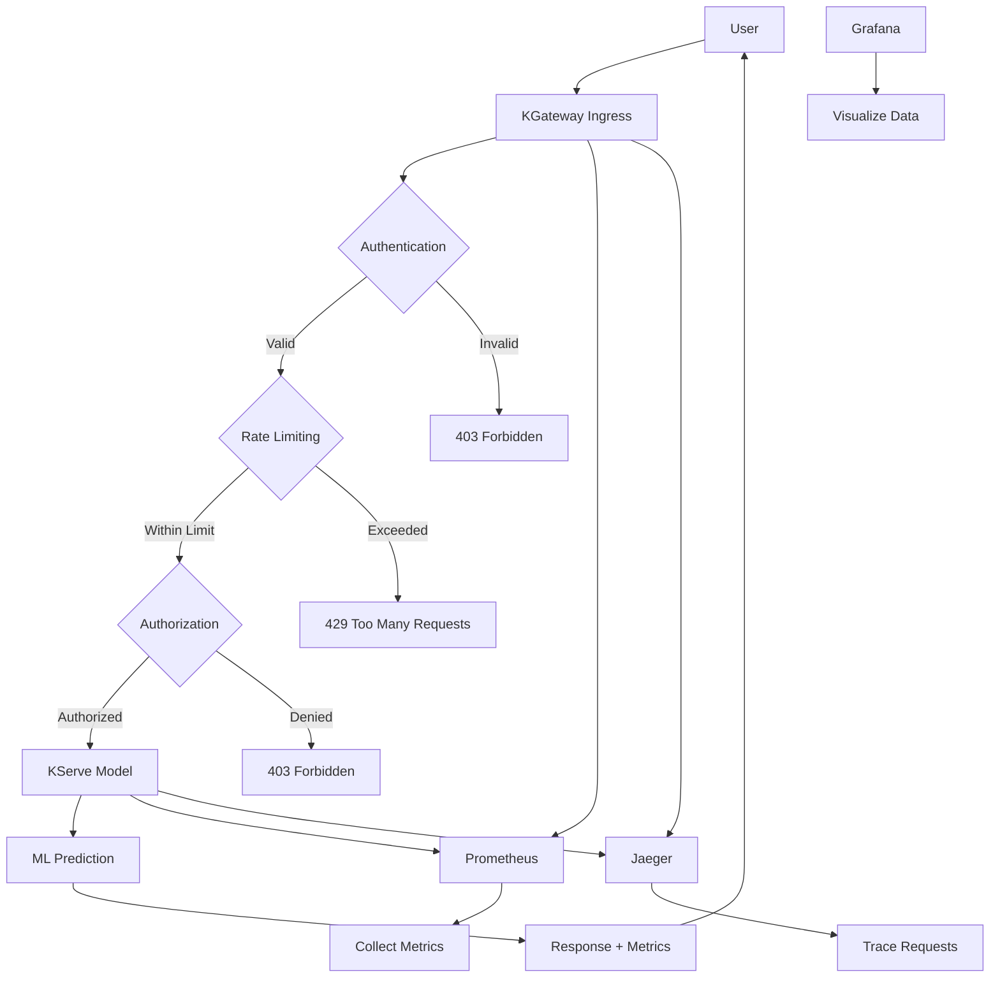

# 🚀 KGateway KServe Integration - User Documentation

Comprehensive guide for implementing KGateway as an ingress gateway for KServe with production-ready configurations.

## 📋 Prerequisites

### Required Tools
* **`kubectl`** - Kubernetes CLI (v1.29+)
* **`helm`** - Package manager (v3.12+)
* **`curl`** - API testing (v7.68+)
* **`git`** - Repository access (v2.30+)
* **`jq`** - JSON processing (v1.6+)

### Verify Installation
```bash
kubectl version --client --output=json | jq '.clientVersion'
helm version --short
curl --version | head -1
git --version
jq --version
```

### Kubernetes Cluster
**Version**: Kubernetes 1.29+ required

```bash
# Check cluster version
kubectl version --output=json | jq '.serverVersion'
kubectl cluster-info
kubectl get nodes -o wide
```

### Envoy Gateway
**Version**: Envoy Gateway 1.3.0+ required

```bash
# Install Envoy Gateway
helm repo add envoy-gateway https://envoyproxy.github.io/gateway-helm
helm repo update
helm upgrade -i eg envoy-gateway/envoy-gateway \
    --version 1.3.0 \
    --namespace envoy-gateway-system \
    --create-namespace

kubectl wait --timeout=5m -n envoy-gateway-system deployment/envoy-gateway --for=condition=Available
```

### KServe Installation
**Version**: KServe 0.12.0+ required

```bash
# Install KServe
kubectl apply -f https://github.com/kserve/kserve/releases/download/v0.12.0/kserve.yaml
kubectl wait --timeout=10m -n kserve deployment/kserve-controller-manager --for=condition=Available
```

### System Requirements
- **CPU**: 4+ cores (8+ for production)
- **Memory**: 8GB+ RAM (16GB+ for production)
- **Storage**: 50GB+ disk space (100GB+ for production)
- **Network**: Stable internet connection

## 📚 Documentation Overview

### 🌐 [1. KGateway as Ingress](01-kgateway-ingress.md)
- Setting up KGateway ingress controller
- Configuring routing rules for model endpoints
- Managing HTTP/HTTPS traffic and certificates

### ⚡ [2. Rate Limiting](02-rate-limiting.md)
- Implementing token bucket rate limiting
- Setting different limits for different user types
- Monitoring rate limit violations

### 🔐 [3. External Authentication](03-external-auth.md)
- Setting up OPA (Open Policy Agent) for external auth
- Writing policy rules in Rego language
- Implementing complex authorization logic

### 🗝️ [4. JWT & RBAC](04-jwt-rbac.md)
- Understanding JWT structure and validation
- Designing role-based access control hierarchies
- Configuring security policies

### 📊 [5. Observability](05-observability.md)
- Setting up Prometheus for metrics collection
- Creating Grafana dashboards for visualization
- Implementing distributed tracing with Jaeger

## 🎯 Quick Start Guide

### 1. Deploy the Platform
```bash
git clone https://github.com/your-org/kgateway.git
cd kgateway/examples/kserve-integration

kubectl create namespace ml-models
kubectl create namespace monitoring

# Deploy production setup
./deploy-production.sh

# Verify deployment
kubectl get pods -A | grep -E "(kgateway|kserve|monitoring)"
```

### 2. Test the Integration
```bash
# Run comprehensive tests
./test-production-features.sh

# Check test results
kubectl logs -n ml-models deployment/test-runner
```

### 3. Access Monitoring
```bash
# Prometheus (metrics)
kubectl port-forward -n monitoring svc/prometheus 9090:9090 &
# Open http://localhost:9090

# Grafana (dashboards) - admin/admin123
kubectl port-forward -n monitoring svc/grafana 3000:3000 &
# Open http://localhost:3000

# Jaeger (tracing)
kubectl port-forward -n monitoring svc/jaeger 16686:16686 &
# Open http://localhost:16686
```

## 🧩 Architecture Overview



## 🔍 Troubleshooting Guide

### Gateway Not Accessible
```bash
kubectl get gateway -A
kubectl describe gateway kgateway-gateway -n kgateway-system
kubectl get svc -n kgateway-system | grep LoadBalancer
kubectl logs -n kgateway-system deployment/kgateway-controller
```

### Authentication Failures
```bash
kubectl logs -n kgateway-system deployment/kgateway-controller | grep jwt
kubectl get requestauthentication -A
kubectl get authorizationpolicy -A
echo "$JWT_TOKEN" | cut -d. -f2 | base64 --decode | jq .
```

### High Response Times
```bash
kubectl top pods -n ml-models
kubectl top nodes
kubectl logs -n kgateway-system deployment/kgateway-controller | grep rate_limit
```

### Missing Metrics
```bash
kubectl port-forward -n monitoring svc/prometheus 9090:9090 &
# Visit http://localhost:9090/targets
kubectl get pods -n ml-models -o yaml | grep -A 5 -B 5 prometheus
```

## 📊 Testing Scenarios

### 1. Basic Functionality Test
```bash
GATEWAY_IP=$(kubectl get svc -n kgateway-system kgateway-gateway -o jsonpath='{.status.loadBalancer.ingress[0].ip}')

curl -v http://$GATEWAY_IP/health

curl -X POST http://$GATEWAY_IP/v1/models/sklearn-iris:predict \
  -H "Content-Type: application/json" \
  -d '{"instances": [[5.1, 3.5, 1.4, 0.2]]}' \
  -w "\nTime: %{time_total}s\n"
```

### 2. Authentication Test
```bash
# Without token (should fail)
curl -X POST http://$GATEWAY_IP/v1/models/sklearn-iris:predict \
  -H "Content-Type: application/json" \
  -d '{"instances": [[5.1, 3.5, 1.4, 0.2]]}' \
  -w "\nStatus: %{http_code}\n"

# With valid token (should succeed)
curl -X POST http://$GATEWAY_IP/v1/models/sklearn-iris:predict \
  -H "Authorization: Bearer $JWT_TOKEN" \
  -H "Content-Type: application/json" \
  -d '{"instances": [[5.1, 3.5, 1.4, 0.2]]}' \
  -w "\nStatus: %{http_code}\n"
```

### 3. Rate Limiting Test
```bash
for i in {1..200}; do
  curl -s -w "%{http_code}\n" \
    -H "Authorization: Bearer $JWT_TOKEN" \
    http://$GATEWAY_IP/v1/models/sklearn-iris:predict \
    -H "Content-Type: application/json" \
    -d '{"instances": [[5.1, 3.5, 1.4, 0.2]]}' &
done
wait
```

## 🎓 Learning Path

### Beginner (Week 1-2)
1. Read [KGateway Ingress Guide](01-kgateway-ingress.md)
2. Deploy basic setup with single model
3. Test model access and basic functionality
4. Set up basic monitoring dashboards

### Intermediate (Week 3-4)
1. Implement [Rate Limiting](02-rate-limiting.md) with Redis
2. Configure [JWT Authentication](04-jwt-rbac.md) with proper roles
3. Set up basic alerting for critical metrics
4. Optimize performance and resource usage

### Advanced (Week 5-6)
1. Deploy [External Authentication](03-external-auth.md) with OPA
2. Implement comprehensive [Observability](05-observability.md) with tracing
3. Set up production monitoring with SLI/SLO
4. Create custom policies and advanced security features

## 🛡️ Security Best Practices

### Authentication & Authorization
- Use HTTPS in production
- Implement JWT validation with RS256
- Use short-lived tokens (15-60 minutes)
- Enable audit logging
- Regular security reviews

### Rate Limiting
- Set conservative initial limits (100 req/min per user)
- Monitor usage patterns
- Different limits for different user tiers
- Alert on sustained violations

### Network Security
- Use mTLS between services in production
- Implement network policies
- Isolate sensitive workloads
- Regular vulnerability scanning

## 📈 Performance Optimization

### Metrics to Monitor
- **Request Rate**: <1000 RPS
- **Response Time**: <500ms (95th percentile)
- **Error Rate**: <1%
- **Resource Usage**: <80% CPU/memory
- **Model Accuracy**: >95%

### Optimization Strategies
- Cache frequent predictions with Redis
- Process requests in batches (10-100)
- Auto-scale based on demand (2-10 replicas)
- Set resource limits (CPU: 1000m, Memory: 2Gi)

## 🤝 Contributing

1. **Report Issues**: Open an issue with reproduction steps
2. **Suggest Improvements**: Submit pull requests with examples
3. **Share Examples**: Add real-world use cases
4. **Update Documentation**: Keep examples current

## 📞 Support

### Documentation
- 📖 [Technical Reference](../README.md)
- 🔧 [Configuration Examples](../)
- 🧪 [Test Scripts](../test-production-features.ps1)

### Community
- 💬 [Discussions Forum](https://github.com/your-org/kgateway/discussions)
- 🐛 [Issue Tracker](https://github.com/your-org/kgateway/issues)

---

## 🚀 Next Steps

1. **Start with Basics**: Begin with the [KGateway Ingress Guide](01-kgateway-ingress.md)
2. **Follow the Order**: Each guide builds on the previous one
3. **Test Everything**: Use the provided test scripts
4. **Monitor Progress**: Set up observability early
5. **Scale Gradually**: Start with development, then staging, then production

**Ready to build a production-ready ML platform? Let's get started!** 🎯

---

*This documentation demonstrates comprehensive KServe platform capabilities with enterprise-grade features.*
